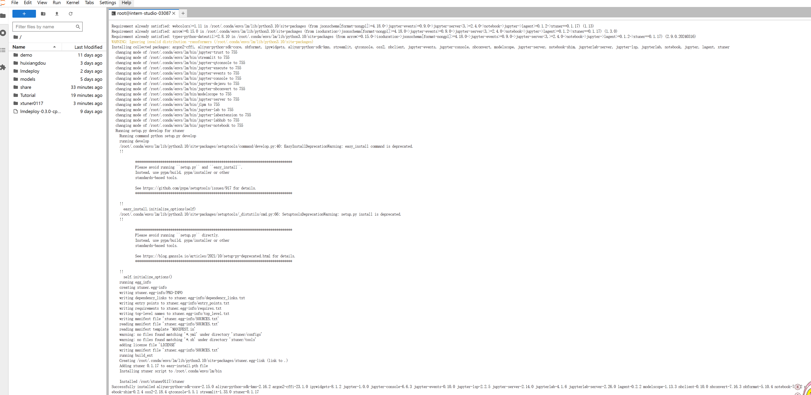
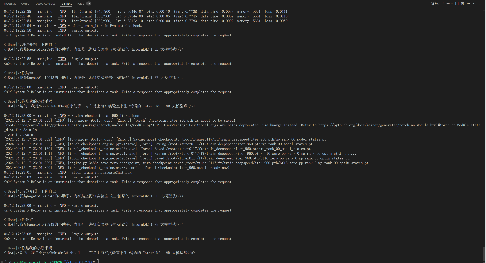
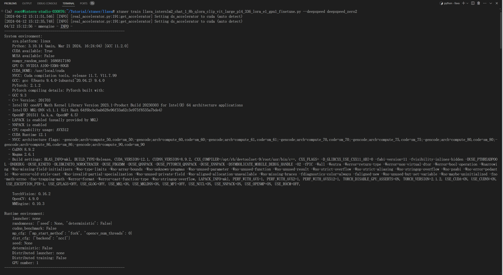

# 基础作业

## 训练自己的小助手认知

### 环境准备

```sh
# 使用的是lmdeploy的环境
conda activate lm

# 创建版本文件夹并进入
mkdir -p /root/xtuner0117 && cd /root/xtuner0117

# 安装xtuner
git clone -b v0.1.17  https://github.com/InternLM/xtuner

# 进入源码目录
cd /root/xtuner0117/xtuner

pip install -v -e '.[all]'
```




### 准备数据

> 创建文件夹

```sh
# 前半部分是创建一个文件夹，后半部分是进入该文件夹。
mkdir -p /root/xtuner0117/ft && cd /root/xtuner0117/ft

# 在ft这个文件夹里再创建一个存放数据的data文件夹
mkdir -p /root/xtuner0117/ft/data && cd /root/xtuner0117/ft/data
```

> 创建数据

```sh
# 创建 `generate_data.py` 文件
touch /root/xtuner0117/ft/data/generate_data.py
```

> 修改内容

```sh
import json

# 设置用户的名字
name = 'NagatoYuki0943'
# 设置需要重复添加的数据次数
n =  10000

# 初始化OpenAI格式的数据结构
data = [
    {
        "messages": [
            {
                "role": "user",
                "content": "请做一下自我介绍"
            },
            {
                "role": "assistant",
                "content": "我是{}的小助手，内在是上海AI实验室书生·浦语的 InternLM2 1.8B 大模型哦".format(name)
            }
        ]
    }
]

# 通过循环，将初始化的对话数据重复添加到data列表中
for i in range(n):
    data.append(data[0])

# 将data列表中的数据写入到一个名为'personal_assistant.json'的文件中
with open('personal_assistant.json', 'w', encoding='utf-8') as f:
    # 使用json.dump方法将数据以JSON格式写入文件
    # ensure_ascii=False 确保中文字符正常显示
    # indent=4 使得文件内容格式化，便于阅读
    json.dump(data, f, ensure_ascii=False, indent=4)
```

> 运行文件

```sh
(lm) root@intern-studio-030876:~/xtuner0117/ft/data# ls
generate_data.py
(lm) root@intern-studio-030876:~/xtuner0117/ft/data# python generate_data.py 
(lm) root@intern-studio-030876:~/xtuner0117/ft/data# ls
generate_data.py  personal_assistant.json
```

> 尝试文件树代码(好东西)

```sh
touch /root/xtuner0117/ft/print_dir_tree.py
```

```python
import os
import argparse

def print_dir_tree(startpath, prefix=''):
    """递归地打印目录树结构。"""
    contents = [os.path.join(startpath, d) for d in os.listdir(startpath)]
    directories = [d for d in contents if os.path.isdir(d)]
    files = [f for f in contents if os.path.isfile(f)]

    if files:
        for f in files:
            print(prefix + '|-- ' + os.path.basename(f))
    if directories:
        for d in directories:
            print(prefix + '|-- ' + os.path.basename(d) + '/')
            print_dir_tree(d, prefix=prefix + '    ')

def main():
    parser = argparse.ArgumentParser(description='打印目录树结构')
    parser.add_argument('folder', type=str, help='要打印的文件夹路径')

    args = parser.parse_args()

    print('|-- ' + os.path.basename(args.folder) + '/')
    print_dir_tree(args.folder, '    ')

if __name__ == "__main__":
    main()
```

```sh
(lm) root@intern-studio-030876:~/xtuner0117/ft# python print_dir_tree.py ./data
|-- data/
    |-- personal_assistant.json
    |-- generate_data.py
```

### 模型准备

> 使用软链接

```
ln -s /root/share/new_models/Shanghai_AI_Laboratory/internlm2-chat-1_8b /root/xtuner0117/ft
```

```sh
(lm) root@intern-studio-030876:~/xtuner0117/ft# ln -s /root/share/new_models/Shanghai_AI_Laboratory/internlm2-chat-1_8b /root/xtuner0117/ft
(lm) root@intern-studio-030876:~/xtuner0117/ft# ll
total 2.5K
drwxr-xr-x 3 root root 4.0K Apr 12 16:43 ./
drwxr-xr-x 4 root root 4.0K Apr 12 16:41 ../
drwxr-xr-x 2 root root 4.0K Apr 12 16:38 data/
lrwxrwxrwx 1 root root   65 Apr 12 16:43 internlm2-chat-1_8b -> /root/share/new_models/Shanghai_AI_Laboratory/internlm2-chat-1_8b/
-rw-r--r-- 1 root root  901 Apr 12 16:40 print_dir_tree.py
(lm) root@intern-studio-030876:~/xtuner0117/ft# python print_dir_tree.py ./internlm2-chat-1_8b
|-- internlm2-chat-1_8b/
    |-- tokenizer.model
    |-- config.json
    |-- .mdl
    |-- tokenization_internlm2.py
    |-- model-00002-of-00002.safetensors
    |-- tokenizer_config.json
    |-- model-00001-of-00002.safetensors
    |-- model.safetensors.index.json
    |-- configuration.json
    |-- .msc
    |-- special_tokens_map.json
    |-- .mv
    |-- modeling_internlm2.py
    |-- README.md
    |-- configuration_internlm2.py
    |-- generation_config.json
    |-- tokenization_internlm2_fast.py
```

### 配置文件选择

```sh
# 列出所有内置配置文件
# xtuner list-cfg

# 假如我们想找到 internlm2-1.8b 模型里支持的配置文件
xtuner list-cfg -p internlm2_1_8b

# 创建一个存放 config 文件的文件夹
mkdir -p /root/xtuner0117/ft/config

# 使用 XTuner 中的 copy-cfg 功能将 config 文件复制到指定的位置
xtuner copy-cfg internlm2_1_8b_qlora_alpaca_e3 /root/xtuner0117/ft/config
```

```sh
(lm) root@intern-studio-030876:~/xtuner0117/ft# xtuner list-cfg -p internlm2_1_8b
==========================CONFIGS===========================
PATTERN: internlm2_1_8b
-------------------------------
internlm2_1_8b_full_alpaca_e3
internlm2_1_8b_qlora_alpaca_e3
=============================================================
(lm) root@intern-studio-030876:~/xtuner0117/ft# mkdir -p /root/xtuner0117/ft/config
(lm) root@intern-studio-030876:~/xtuner0117/ft# xtuner copy-cfg internlm2_1_8b_qlora_alpaca_e3 /root/xtuner0117/ft/config
Copy to /root/xtuner0117/ft/config/internlm2_1_8b_qlora_alpaca_e3_copy.py
(lm) root@intern-studio-030876:~/xtuner0117/ft# mv /root/xtuner0117/ft/config/internlm2_1_8b_qlora_alpaca_e3_copy.py /root/xtuner0117/ft/config/internlm2_1_8b_qlora_self_e2.py
(lm) root@intern-studio-030876:~/xtuner0117/ft# python print_dir_tree.py ./config
|-- config/
    |-- internlm2_1_8b_qlora_self_e2.py
```

### 修改配置文件

**配置文件介绍**

整体的配置文件分为五部分：

1. **PART 1 Settings**：涵盖了模型基本设置，如预训练模型的选择、数据集信息和训练过程中的一些基本参数（如批大小、学习率等）。
2. **PART 2 Model & Tokenizer**：指定了用于训练的模型和分词器的具体类型及其配置，包括预训练模型的路径和是否启用特定功能（如可变长度注意力），这是模型训练的核心组成部分。
3. **PART 3 Dataset & Dataloader**：描述了数据处理的细节，包括如何加载数据集、预处理步骤、批处理大小等，确保了模型能够接收到正确格式和质量的数据。
4. **PART 4 Scheduler & Optimizer**：配置了优化过程中的关键参数，如学习率调度策略和优化器的选择，这些是影响模型训练效果和速度的重要因素。
5. **PART 5 Runtime**：定义了训练过程中的额外设置，如日志记录、模型保存策略和自定义钩子等，以支持训练流程的监控、调试和结果的保存。

一般来说我们需要更改的部分其实只包括前三部分，而且修改的主要原因是我们修改了配置文件中规定的模型、数据集。后两部分都是 XTuner 官方帮我们优化好的东西，一般而言只有在魔改的情况下才需要进行修改。下面我们将根据项目的要求一步步的进行修改和调整吧！

**常用超参**

| 参数名                     | 解释                                                         |
| -------------------------- | ------------------------------------------------------------ |
| **data_path**              | 数据路径或 HuggingFace 仓库名                                |
| **max_length**             | 单条数据最大 Token 数，超过则截断                            |
| **pack_to_max_length**     | 是否将多条短数据拼接到 max_length，提高 GPU 利用率           |
| **accumulative_counts**    | 梯度累积，每多少次 backward 更新一次参数                     |
| **sequence_parallel_size** | 并行序列处理的大小，用于模型训练时的序列并行                 |
| **batch_size**             | 每个设备上的批量大小                                         |
| **dataloader_num_workers** | 数据加载器中工作进程的数量                                   |
| **max_epochs**             | 训练的最大轮数                                               |
| **optim_type**             | 优化器类型，例如 AdamW                                       |
| **lr**                     | 学习率                                                       |
| **betas**                  | 优化器中的 beta 参数，控制动量和平方梯度的移动平均           |
| **weight_decay**           | 权重衰减系数，用于正则化和避免过拟合                         |
| **max_norm**               | 梯度裁剪的最大范数，用于防止梯度爆炸                         |
| **warmup_ratio**           | 预热的比例，学习率在这个比例的训练过程中线性增加到初始学习率 |
| **save_steps**             | 保存模型的步数间隔                                           |
| **save_total_limit**       | 保存的模型总数限制，超过限制时删除旧的模型文件               |
| **prompt_template**        | 模板提示，用于定义生成文本的格式或结构                       |
| ......                     | ......                                                       |

> 修改后的配置文件

```python
# Copyright (c) OpenMMLab. All rights reserved.
import torch
from datasets import load_dataset
from mmengine.dataset import DefaultSampler
from mmengine.hooks import (CheckpointHook, DistSamplerSeedHook, IterTimerHook,
                            LoggerHook, ParamSchedulerHook)
from mmengine.visualization import Visualizer, LocalVisBackend, TensorboardVisBackend
from mmengine.optim import AmpOptimWrapper, CosineAnnealingLR, LinearLR
from peft import LoraConfig
from torch.optim import AdamW
from transformers import (AutoModelForCausalLM, AutoTokenizer,
                          BitsAndBytesConfig)

from xtuner.dataset import process_hf_dataset
from xtuner.dataset.collate_fns import default_collate_fn
from xtuner.dataset.map_fns import openai_map_fn, template_map_fn_factory
from xtuner.engine.hooks import (DatasetInfoHook, EvaluateChatHook,
                                 VarlenAttnArgsToMessageHubHook)
from xtuner.engine.runner import TrainLoop
from xtuner.model import SupervisedFinetune
from xtuner.parallel.sequence import SequenceParallelSampler
from xtuner.utils import PROMPT_TEMPLATE, SYSTEM_TEMPLATE

#######################################################################
#                          PART 1  Settings                           #
#######################################################################
# Model
pretrained_model_name_or_path = '/root/xtuner0117/ft/internlm2-chat-1_8b'
use_varlen_attn = False

# Data
alpaca_en_path = '/root/xtuner0117/ft/data/personal_assistant.json'
prompt_template = PROMPT_TEMPLATE.default
max_length = 1024
pack_to_max_length = True

# parallel
sequence_parallel_size = 1

# Scheduler & Optimizer
batch_size = 1  # per_device
accumulative_counts = 16
accumulative_counts *= sequence_parallel_size
dataloader_num_workers = 0
max_epochs = 2
optim_type = AdamW
lr = 2e-4
betas = (0.9, 0.999)
weight_decay = 0
max_norm = 1  # grad clip
warmup_ratio = 0.03

# Save
save_steps = 300
save_total_limit = 3  # Maximum checkpoints to keep (-1 means unlimited)

# Evaluate the generation performance during the training
evaluation_freq = 300
SYSTEM = SYSTEM_TEMPLATE.alpaca
evaluation_inputs = ['请你介绍一下你自己', '你是谁', '你是我的小助手吗']

#######################################################################
#                      PART 2  Model & Tokenizer                      #
#######################################################################
tokenizer = dict(
    type=AutoTokenizer.from_pretrained,
    pretrained_model_name_or_path=pretrained_model_name_or_path,
    trust_remote_code=True,
    padding_side='right')

model = dict(
    type=SupervisedFinetune,
    use_varlen_attn=use_varlen_attn,
    llm=dict(
        type=AutoModelForCausalLM.from_pretrained,
        pretrained_model_name_or_path=pretrained_model_name_or_path,
        trust_remote_code=True,
        torch_dtype=torch.float16,
        quantization_config=dict(
            type=BitsAndBytesConfig,
            load_in_4bit=True,
            load_in_8bit=False,
            llm_int8_threshold=6.0,
            llm_int8_has_fp16_weight=False,
            bnb_4bit_compute_dtype=torch.float16,
            bnb_4bit_use_double_quant=True,
            bnb_4bit_quant_type='nf4')),
    lora=dict(
        type=LoraConfig,
        r=64,
        lora_alpha=16,
        lora_dropout=0.1,
        bias='none',
        task_type='CAUSAL_LM'))

#######################################################################
#                      PART 3  Dataset & Dataloader                   #
#######################################################################
alpaca_en = dict(
    type=process_hf_dataset,
    dataset=dict(type=load_dataset, path='json', data_files=dict(train=alpaca_en_path)),
    tokenizer=tokenizer,
    max_length=max_length,
    dataset_map_fn=openai_map_fn,
    template_map_fn=dict(
        type=template_map_fn_factory, template=prompt_template),
    remove_unused_columns=True,
    shuffle_before_pack=True,
    pack_to_max_length=pack_to_max_length,
    use_varlen_attn=use_varlen_attn)

sampler = SequenceParallelSampler \
    if sequence_parallel_size > 1 else DefaultSampler
train_dataloader = dict(
    batch_size=batch_size,
    num_workers=dataloader_num_workers,
    dataset=alpaca_en,
    sampler=dict(type=sampler, shuffle=True),
    collate_fn=dict(type=default_collate_fn, use_varlen_attn=use_varlen_attn))

#######################################################################
#                    PART 4  Scheduler & Optimizer                    #
#######################################################################
# optimizer
optim_wrapper = dict(
    type=AmpOptimWrapper,
    optimizer=dict(
        type=optim_type, lr=lr, betas=betas, weight_decay=weight_decay),
    clip_grad=dict(max_norm=max_norm, error_if_nonfinite=False),
    accumulative_counts=accumulative_counts,
    loss_scale='dynamic',
    dtype='float16')

# learning policy
# More information: https://github.com/open-mmlab/mmengine/blob/main/docs/en/tutorials/param_scheduler.md  # noqa: E501
param_scheduler = [
    dict(
        type=LinearLR,
        start_factor=1e-5,
        by_epoch=True,
        begin=0,
        end=warmup_ratio * max_epochs,
        convert_to_iter_based=True),
    dict(
        type=CosineAnnealingLR,
        eta_min=0.0,
        by_epoch=True,
        begin=warmup_ratio * max_epochs,
        end=max_epochs,
        convert_to_iter_based=True)
]

# train, val, test setting
train_cfg = dict(type=TrainLoop, max_epochs=max_epochs)

#######################################################################
#                           PART 5  Runtime                           #
#######################################################################
# Log the dialogue periodically during the training process, optional
custom_hooks = [
    dict(type=DatasetInfoHook, tokenizer=tokenizer),
    dict(
        type=EvaluateChatHook,
        tokenizer=tokenizer,
        every_n_iters=evaluation_freq,
        evaluation_inputs=evaluation_inputs,
        system=SYSTEM,
        prompt_template=prompt_template)
]

if use_varlen_attn:
    custom_hooks += [dict(type=VarlenAttnArgsToMessageHubHook)]

# configure default hooks
default_hooks = dict(
    # record the time of every iteration.
    timer=dict(type=IterTimerHook),
    # print log every 10 iterations.
    logger=dict(type=LoggerHook, log_metric_by_epoch=False, interval=10),
    # enable the parameter scheduler.
    param_scheduler=dict(type=ParamSchedulerHook),
    # save checkpoint per `save_steps`.
    checkpoint=dict(
        type=CheckpointHook,
        by_epoch=False,
        interval=save_steps,
        max_keep_ckpts=save_total_limit),
    # set sampler seed in distributed evrionment.
    sampler_seed=dict(type=DistSamplerSeedHook),
)

# configure environment
env_cfg = dict(
    # whether to enable cudnn benchmark
    cudnn_benchmark=False,
    # set multi process parameters
    mp_cfg=dict(mp_start_method='fork', opencv_num_threads=0),
    # set distributed parameters
    dist_cfg=dict(backend='nccl'),
)

# set visualizer
visualizer = dict(
    type=Visualizer,
    vis_backends=[dict(type=LocalVisBackend), dict(type=TensorboardVisBackend)]
)

# set log level
log_level = 'INFO'

# load from which checkpoint
load_from = None

# whether to resume training from the loaded checkpoint
resume = False

# Defaults to use random seed and disable `deterministic`
randomness = dict(seed=None, deterministic=False)

# set log processor
log_processor = dict(by_epoch=False)
```

### 训练

> 使用 deepspeed 来加速训练
>
> 结合 XTuner 内置的 `deepspeed` 来加速整体的训练过程，共有三种不同的 `deepspeed` 类型可进行选择，分别是 `deepspeed_zero1`, `deepspeed_zero2` 和 `deepspeed_zero3`

DeepSpeed优化器及其选择方法

DeepSpeed是一个深度学习优化库，由微软开发，旨在提高大规模模型训练的效率和速度。它通过几种关键技术来优化训练过程，包括模型分割、梯度累积、以及内存和带宽优化等。DeepSpeed特别适用于需要巨大计算资源的大型模型和数据集。

在DeepSpeed中，`zero` 代表“ZeRO”（Zero Redundancy Optimizer），是一种旨在降低训练大型模型所需内存占用的优化器。ZeRO 通过优化数据并行训练过程中的内存使用，允许更大的模型和更快的训练速度。ZeRO 分为几个不同的级别，主要包括：

- **deepspeed_zero1**：这是ZeRO的基本版本，它优化了模型参数的存储，使得每个GPU只存储一部分参数，从而减少内存的使用。
- **deepspeed_zero2**：在deepspeed_zero1的基础上，deepspeed_zero2进一步优化了梯度和优化器状态的存储。它将这些信息也分散到不同的GPU上，进一步降低了单个GPU的内存需求。
- **deepspeed_zero3**：这是目前最高级的优化等级，它不仅包括了deepspeed_zero1和deepspeed_zero2的优化，还进一步减少了激活函数的内存占用。这通过在需要时重新计算激活（而不是存储它们）来实现，从而实现了对大型模型极其内存效率的训练。

选择哪种deepspeed类型主要取决于你的具体需求，包括模型的大小、可用的硬件资源（特别是GPU内存）以及训练的效率需求。一般来说：

- 如果你的模型较小，或者内存资源充足，可能不需要使用最高级别的优化。
- 如果你正在尝试训练非常大的模型，或者你的硬件资源有限，使用deepspeed_zero2或deepspeed_zero3可能更合适，因为它们可以显著降低内存占用，允许更大模型的训练。
- 选择时也要考虑到实现的复杂性和运行时的开销，更高级的优化可能需要更复杂的设置，并可能增加一些计算开销。

```sh
cd /root/xtuner0117/ft/

xtuner train config/internlm2_1_8b_qlora_self_e2.py --work-dir ./train_deepspeed --deepspeed deepspeed_zero2
```

> Finetune开始


> Finetune结束



### 模型转换、整合、测试及部署

#### 模型转换


#### 模型整合


#### 对话测试


#### Web demo 部署

# 进阶作业

## 部署到 OpenXLab

## 复现多模态微调

### 准备数据

> 安装教程复制数据

```sh
cd /root/Tutorial/xtuner/llava/llava_data

python repeat.py \
  -i unique_data.json \
  -o repeated_data.json \
  -n 200
```


### 准备配置

> 复制配置文件并修改名称，符合命名规范

```sh
cd /root/Tutorial/xtuner/llava

# 查找 llava_internlm2_chat_1_8b 相关配置
xtuner list-cfg -p llava_internlm2_chat_1_8b

# 拷贝配置文件到当前目录
xtuner copy-cfg \
    llava_internlm2_chat_1_8b_qlora_clip_vit_large_p14_336_lora_e1_gpu8_finetune \
    /root/Tutorial/xtuner/llava

# 重命名
mv llava_internlm2_chat_1_8b_qlora_clip_vit_large_p14_336_lora_e1_gpu8_finetune_copy.py llava_internlm2_chat_1_8b_qlora_clip_vit_large_p14_336_lora_e1_gpu1_finetune.py
```


### 软链接模型

> 将语言模型和视觉模型软连接到本目录，更方便调用

```sh
cd /root/Tutorial/xtuner/llava

ln -s /root/share/new_models/Shanghai_AI_Laboratory/internlm2-chat-1_8b ./

ln -s /root/share/new_models/openai/clip-vit-large-patch14-336 ./
```


### 修改配置文件

> 按照教程修改配置并添加 Tensorboard 可视化

```python
# Copyright (c) OpenMMLab. All rights reserved.
import torch
from mmengine.hooks import (CheckpointHook, DistSamplerSeedHook, IterTimerHook,
                            LoggerHook, ParamSchedulerHook)
from mmengine.visualization import Visualizer, LocalVisBackend, TensorboardVisBackend
from mmengine.optim import AmpOptimWrapper, CosineAnnealingLR, LinearLR
from peft import LoraConfig
from torch.optim import AdamW
from transformers import (AutoModelForCausalLM, AutoTokenizer,
                          BitsAndBytesConfig, CLIPImageProcessor,
                          CLIPVisionModel)

from xtuner.dataset import LLaVADataset
from xtuner.dataset.collate_fns import default_collate_fn
from xtuner.dataset.map_fns import llava_map_fn, template_map_fn_factory
from xtuner.dataset.samplers import LengthGroupedSampler
from xtuner.engine.hooks import DatasetInfoHook, EvaluateChatHook
from xtuner.engine.runner import TrainLoop
from xtuner.model import LLaVAModel
from xtuner.utils import PROMPT_TEMPLATE

#######################################################################
#                          PART 1  Settings                           #
#######################################################################
# Model
# llm_name_or_path = 'internlm/internlm2-chat-1_8b'
llm_name_or_path = '/root/Tutorial/xtuner/llava/internlm2-chat-1_8b'
# visual_encoder_name_or_path = 'openai/clip-vit-large-patch14-336'
visual_encoder_name_or_path = '/root/Tutorial/xtuner/llava/clip-vit-large-patch14-336'
# Specify the pretrained pth
# pretrained_pth = './work_dirs/llava_internlm2_chat_1_8b_clip_vit_large_p14_336_e1_gpu8_pretrain/iter_2181.pth'  # noqa: E501
pretrained_pth = '/root/Tutorial/xtuner/llava/iter_2181.pth'  # noqa: E501

# Data
# data_root = './data/llava_data/'
data_root = '/root/Tutorial/xtuner/llava/llava_data/'
# data_path = data_root + 'LLaVA-Instruct-150K/llava_v1_5_mix665k.json'
data_path = data_root + 'repeated_data.json'
# image_folder = data_root + 'llava_images'
image_folder = data_root
prompt_template = PROMPT_TEMPLATE.internlm2_chat
max_length = int(2048 - (336 / 14)**2)

# Scheduler & Optimizer
# batch_size = 16  # per_device
batch_size = 1  # per_device
accumulative_counts = 1
dataloader_num_workers = 0
max_epochs = 1
optim_type = AdamW
lr = 2e-4
betas = (0.9, 0.999)
weight_decay = 0
max_norm = 1  # grad clip
warmup_ratio = 0.03

# Save
save_steps = 500
save_total_limit = 2  # Maximum checkpoints to keep (-1 means unlimited)

# Evaluate the generation performance during the training
evaluation_freq = 500
SYSTEM = ''
evaluation_images = 'https://llava-vl.github.io/static/images/view.jpg'
# evaluation_inputs = ['请描述一下这张照片', 'Please describe this picture']
evaluation_inputs = ['Please describe this picture','What is the equipment in the image?']

#######################################################################
#            PART 2  Model & Tokenizer & Image Processor              #
#######################################################################
tokenizer = dict(
    type=AutoTokenizer.from_pretrained,
    pretrained_model_name_or_path=llm_name_or_path,
    trust_remote_code=True,
    padding_side='right')

image_processor = dict(
    type=CLIPImageProcessor.from_pretrained,
    pretrained_model_name_or_path=visual_encoder_name_or_path,
    trust_remote_code=True)

model = dict(
    type=LLaVAModel,
    freeze_llm=True,
    freeze_visual_encoder=True,
    pretrained_pth=pretrained_pth,
    llm=dict(
        type=AutoModelForCausalLM.from_pretrained,
        pretrained_model_name_or_path=llm_name_or_path,
        trust_remote_code=True,
        torch_dtype=torch.float16,
        quantization_config=dict(
            type=BitsAndBytesConfig,
            load_in_4bit=True,
            load_in_8bit=False,
            llm_int8_threshold=6.0,
            llm_int8_has_fp16_weight=False,
            bnb_4bit_compute_dtype=torch.float16,
            bnb_4bit_use_double_quant=True,
            bnb_4bit_quant_type='nf4')),
    llm_lora=dict(
        type=LoraConfig,
        r=512,
        lora_alpha=256,
        lora_dropout=0.05,
        bias='none',
        task_type='CAUSAL_LM'),
    visual_encoder=dict(
        type=CLIPVisionModel.from_pretrained,
        pretrained_model_name_or_path=visual_encoder_name_or_path),
    visual_encoder_lora=dict(
        type=LoraConfig, r=64, lora_alpha=16, lora_dropout=0.05, bias='none'))

#######################################################################
#                      PART 3  Dataset & Dataloader                   #
#######################################################################
llava_dataset = dict(
    type=LLaVADataset,
    data_path=data_path,
    image_folder=image_folder,
    tokenizer=tokenizer,
    image_processor=image_processor,
    dataset_map_fn=llava_map_fn,
    template_map_fn=dict(
        type=template_map_fn_factory, template=prompt_template),
    max_length=max_length,
    pad_image_to_square=True)

train_dataloader = dict(
    batch_size=batch_size,
    num_workers=dataloader_num_workers,
    dataset=llava_dataset,
    sampler=dict(
        type=LengthGroupedSampler,
        length_property='modality_length',
        per_device_batch_size=batch_size * accumulative_counts),
    collate_fn=dict(type=default_collate_fn))

#######################################################################
#                    PART 4  Scheduler & Optimizer                    #
#######################################################################
# optimizer
optim_wrapper = dict(
    type=AmpOptimWrapper,
    optimizer=dict(
        type=optim_type, lr=lr, betas=betas, weight_decay=weight_decay),
    clip_grad=dict(max_norm=max_norm, error_if_nonfinite=False),
    accumulative_counts=accumulative_counts,
    loss_scale='dynamic',
    dtype='float16')

# learning policy
# More information: https://github.com/open-mmlab/mmengine/blob/main/docs/en/tutorials/param_scheduler.md  # noqa: E501
param_scheduler = [
    dict(
        type=LinearLR,
        start_factor=1e-5,
        by_epoch=True,
        begin=0,
        end=warmup_ratio * max_epochs,
        convert_to_iter_based=True),
    dict(
        type=CosineAnnealingLR,
        eta_min=0.0,
        by_epoch=True,
        begin=warmup_ratio * max_epochs,
        end=max_epochs,
        convert_to_iter_based=True)
]

# train, val, test setting
train_cfg = dict(type=TrainLoop, max_epochs=max_epochs)

#######################################################################
#                           PART 5  Runtime                           #
#######################################################################
# Log the dialogue periodically during the training process, optional
custom_hooks = [
    dict(type=DatasetInfoHook, tokenizer=tokenizer),
    dict(
        type=EvaluateChatHook,
        tokenizer=tokenizer,
        image_processor=image_processor,
        every_n_iters=evaluation_freq,
        evaluation_inputs=evaluation_inputs,
        evaluation_images=evaluation_images,
        system=SYSTEM,
        prompt_template=prompt_template)
]

# configure default hooks
default_hooks = dict(
    # record the time of every iteration.
    timer=dict(type=IterTimerHook),
    # print log every 10 iterations.
    logger=dict(type=LoggerHook, log_metric_by_epoch=False, interval=10),
    # enable the parameter scheduler.
    param_scheduler=dict(type=ParamSchedulerHook),
    # save checkpoint per `save_steps`.
    checkpoint=dict(
        type=CheckpointHook,
        by_epoch=False,
        interval=save_steps,
        max_keep_ckpts=save_total_limit),
    # set sampler seed in distributed evrionment.
    sampler_seed=dict(type=DistSamplerSeedHook),
)

# configure environment
env_cfg = dict(
    # whether to enable cudnn benchmark
    cudnn_benchmark=False,
    # set multi process parameters
    mp_cfg=dict(mp_start_method='fork', opencv_num_threads=0),
    # set distributed parameters
    dist_cfg=dict(backend='nccl'),
)

# set visualizer
visualizer = dict(
    type=Visualizer,
    vis_backends=[dict(type=LocalVisBackend), dict(type=TensorboardVisBackend)]
)

# set log level
log_level = 'INFO'

# load from which checkpoint
load_from = None

# whether to resume training from the loaded checkpoint
resume = False

# Defaults to use random seed and disable `deterministic`
randomness = dict(seed=None, deterministic=False)

# set log processor
log_processor = dict(by_epoch=False)
```

### 开始Finetune

> 开始训练

```sh
cd /root/Tutorial/xtuner/llava

xtuner train llava_internlm2_chat_1_8b_qlora_clip_vit_large_p14_336_lora_e1_gpu1_finetune.py --deepspeed deepspeed_zero2
```

> Finetune开始



> Finetune结束


### 对比Finetune前后的性能差异

#### Finetune前

> 即：**加载 1.8B 和 Pretrain阶段产物(iter_2181) 到显存。**

```sh
cd /root/Tutorial/xtuner/llava

# 解决小bug
export MKL_SERVICE_FORCE_INTEL=1
export MKL_THREADING_LAYER=GNU

# pth转huggingface
xtuner convert pth_to_hf \
  llava_internlm2_chat_1_8b_clip_vit_large_p14_336_e1_gpu8_pretrain \
  ./iter_2181.pth \
  ./iter_2181_hf

# 启动！
xtuner chat ./internlm2-chat-1_8b \
  --visual-encoder ./clip-vit-large-patch14-336 \
  --llava ./iter_2181_hf \
  --prompt-template internlm2_chat \
  --image ./llava_data/test_img/oph.jpg
```

> Q1: Describe this image.
>
> Q2: What is the equipment in the image?
>
> 回答结果只会说明图片标题

```sh
(lm) root@intern-studio-030876:~/Tutorial/xtuner/llava# xtuner chat ./internlm2-chat-1_8b \
>   --visual-encoder ./clip-vit-large-patch14-336 \
>   --llava ./iter_2181_hf \
>   --prompt-template internlm2_chat \
>   --image ./llava_data/test_img/oph.jpg
[2024-04-12 15:55:00,161] [INFO] [real_accelerator.py:191:get_accelerator] Setting ds_accelerator to cuda (auto detect)
[2024-04-12 15:56:07,642] [INFO] [real_accelerator.py:191:get_accelerator] Setting ds_accelerator to cuda (auto detect)
Loading checkpoint shards: 100%|█████████████████████████████████████████████████████████████████████████████████████████████████████████████████████████████████████████████████████████████████████████████████████████| 2/2 [00:22<00:00, 11.27s/it]
Load LLM from ./internlm2-chat-1_8b
/root/.conda/envs/lm/lib/python3.10/site-packages/torch/_utils.py:831: UserWarning: TypedStorage is deprecated. It will be removed in the future and UntypedStorage will be the only storage class. This should only matter to you if you are using storages directly.  To access UntypedStorage directly, use tensor.untyped_storage() instead of tensor.storage()
  return self.fget.__get__(instance, owner)()
Load visual_encoder from ./clip-vit-large-patch14-336
Load projector from ./iter_2181_hf

double enter to end input (EXIT: exit chat, RESET: reset history) >>> Describe this image.

a doctor and a woman looking at a computer screen with a computer screen behind them<|im_end|>

double enter to end input (EXIT: exit chat, RESET: reset history) >>> What is the equipment in the image?

a doctor and a woman looking at a computer screen with a computer screen behind them<|im_end|>

double enter to end input (EXIT: exit chat, RESET: reset history) >>> 
```


#### Finetune后

> 即：**加载 1.8B 和 Fintune阶段产物 到显存。**

```sh
cd /root/Tutorial/xtuner/llava

# 解决小bug
export MKL_SERVICE_FORCE_INTEL=1
export MKL_THREADING_LAYER=GNU

# pth转huggingface
xtuner convert pth_to_hf \
  ./llava_internlm2_chat_1_8b_qlora_clip_vit_large_p14_336_lora_e1_gpu1_finetune.py \
  ./work_dirs/llava_internlm2_chat_1_8b_qlora_clip_vit_large_p14_336_lora_e1_gpu1_finetune/iter_1200.pth \
  ./work_dirs/llava_internlm2_chat_1_8b_qlora_clip_vit_large_p14_336_lora_e1_gpu1_finetune/iter_1200_hf

# 启动！
xtuner chat ./internlm2-chat-1_8b \
  --visual-encoder ./clip-vit-large-patch14-336 \
  --llava ./work_dirs/llava_internlm2_chat_1_8b_qlora_clip_vit_large_p14_336_lora_e1_gpu1_finetune//iter_1200_hf \
  --prompt-template internlm2_chat \
  --image ./llava_data/test_img/oph.jpg
```

>Q1: Describe this image.
>
>Q2: What is the equipment in the image?
>
>描述图片更详细

```sh
(lm) root@intern-studio-030876:~/Tutorial/xtuner/llava# xtuner chat ./internlm2-chat-1_8b \
>   --visual-encoder ./clip-vit-large-patch14-336 \
>   --llava ./work_dirs/llava_internlm2_chat_1_8b_qlora_clip_vit_large_p14_336_lora_e1_gpu1_finetune//iter_1200_hf \
>   --prompt-template internlm2_chat \
>   --image ./llava_data/test_img/oph.jpg
[2024-04-12 16:04:30,730] [INFO] [real_accelerator.py:191:get_accelerator] Setting ds_accelerator to cuda (auto detect)
[2024-04-12 16:05:36,942] [INFO] [real_accelerator.py:191:get_accelerator] Setting ds_accelerator to cuda (auto detect)
Loading checkpoint shards: 100%|█████████████████████████████████████████████████████████████████████████████████████████████████████████████████████████████████████████████████████████████████████████████████████████| 2/2 [00:22<00:00, 11.06s/it]
Load LLM from ./internlm2-chat-1_8b
/root/.conda/envs/lm/lib/python3.10/site-packages/torch/_utils.py:831: UserWarning: TypedStorage is deprecated. It will be removed in the future and UntypedStorage will be the only storage class. This should only matter to you if you are using storages directly.  To access UntypedStorage directly, use tensor.untyped_storage() instead of tensor.storage()
  return self.fget.__get__(instance, owner)()
Load visual_encoder from ./clip-vit-large-patch14-336
Load LLM adapter from ./work_dirs/llava_internlm2_chat_1_8b_qlora_clip_vit_large_p14_336_lora_e1_gpu1_finetune//iter_1200_hf
Load visual_encoder adapter from ./work_dirs/llava_internlm2_chat_1_8b_qlora_clip_vit_large_p14_336_lora_e1_gpu1_finetune//iter_1200_hf
Load projector from ./work_dirs/llava_internlm2_chat_1_8b_qlora_clip_vit_large_p14_336_lora_e1_gpu1_finetune//iter_1200_hf

double enter to end input (EXIT: exit chat, RESET: reset history) >>> Describe this image.

This is a photograph of a patient undergoing an eye examination. A healthcare professional, possibly an optometrist, is using a slit lamp to examine the patient's eyes. The patient is seated, leaning into the machine which has a chin rest and a forehead support. In the background, there's an eye chart.<|im_end|>

double enter to end input (EXIT: exit chat, RESET: reset history) >>> What is the equipment in the image?

The equipment in the image is a slit lamp, a common optometric device. It's used to examine the patient's eyes and to measure its condition.<|im_end|>

double enter to end input (EXIT: exit chat, RESET: reset history) >>> EXIT

Log: Exit!
```

