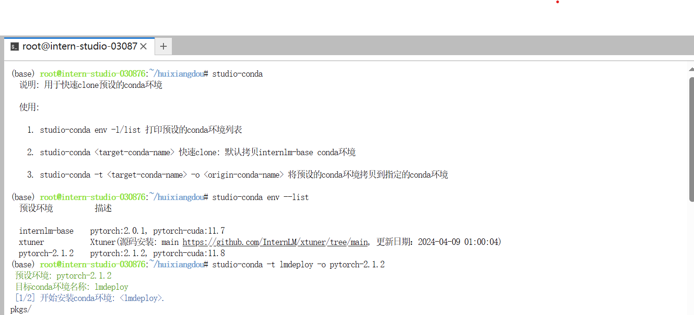
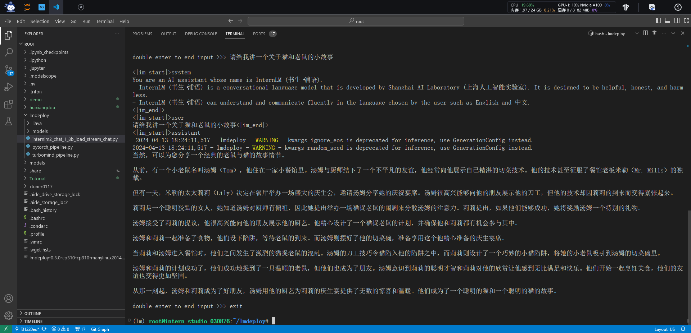
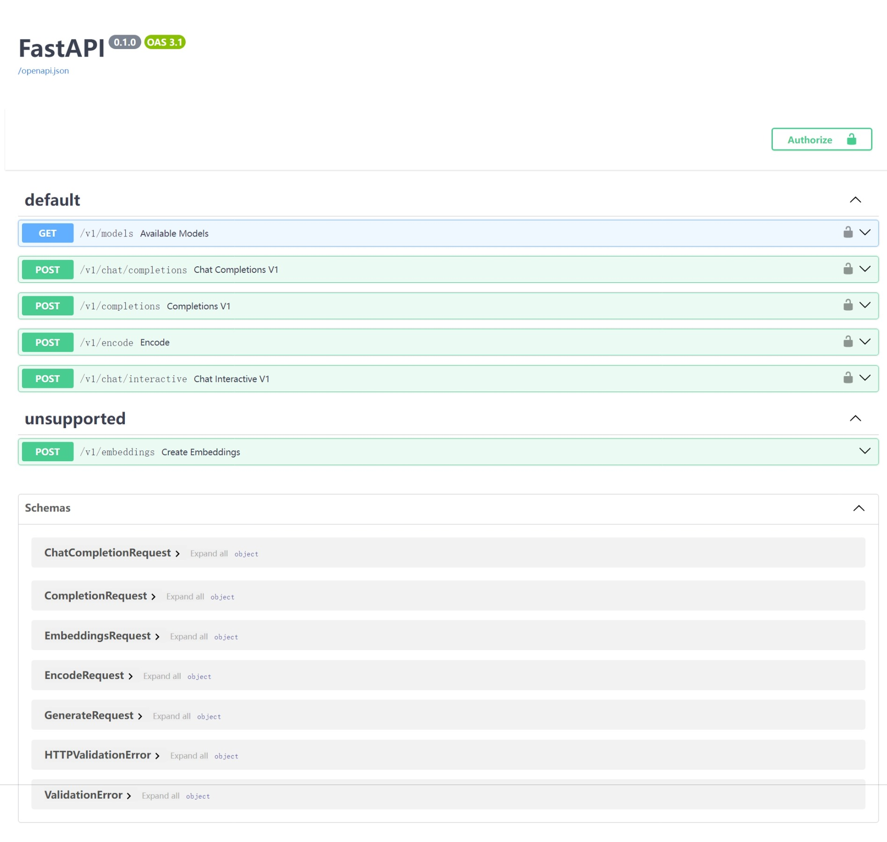
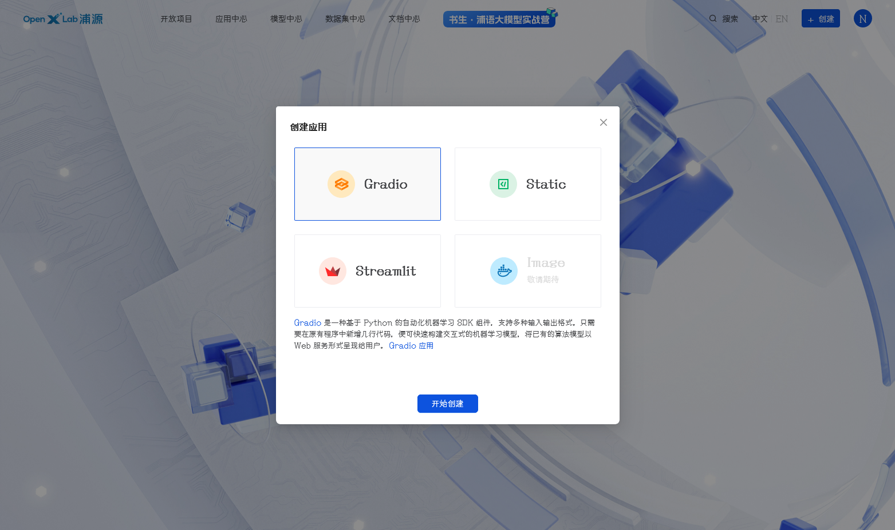
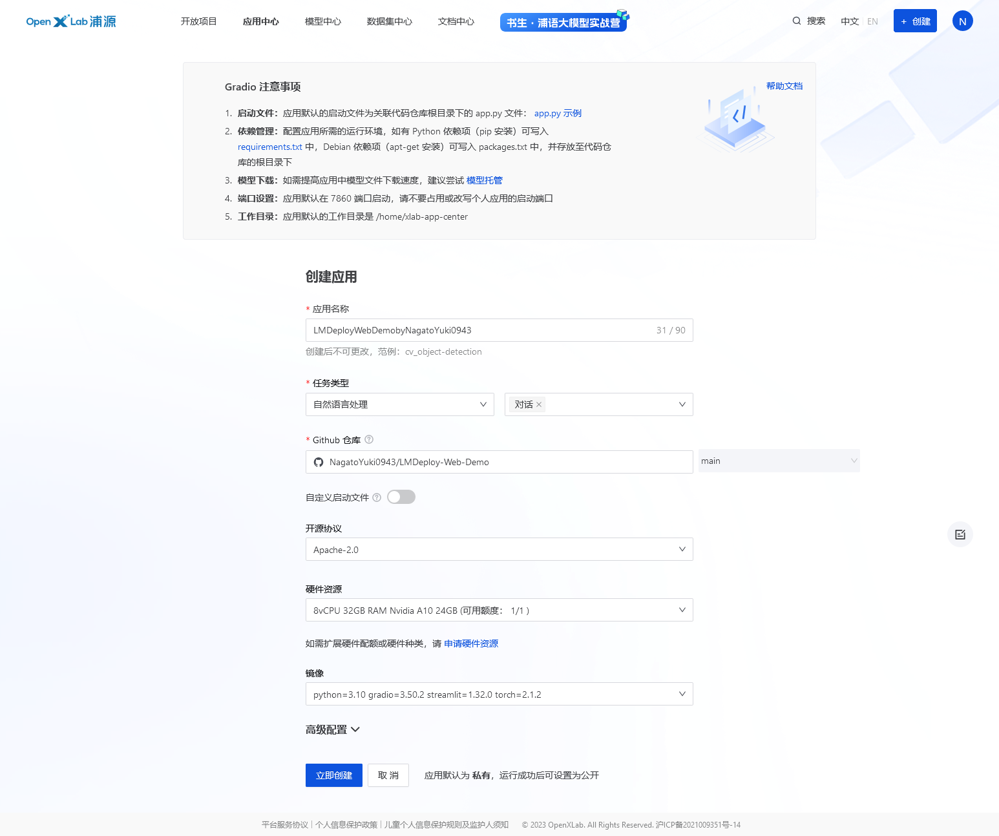
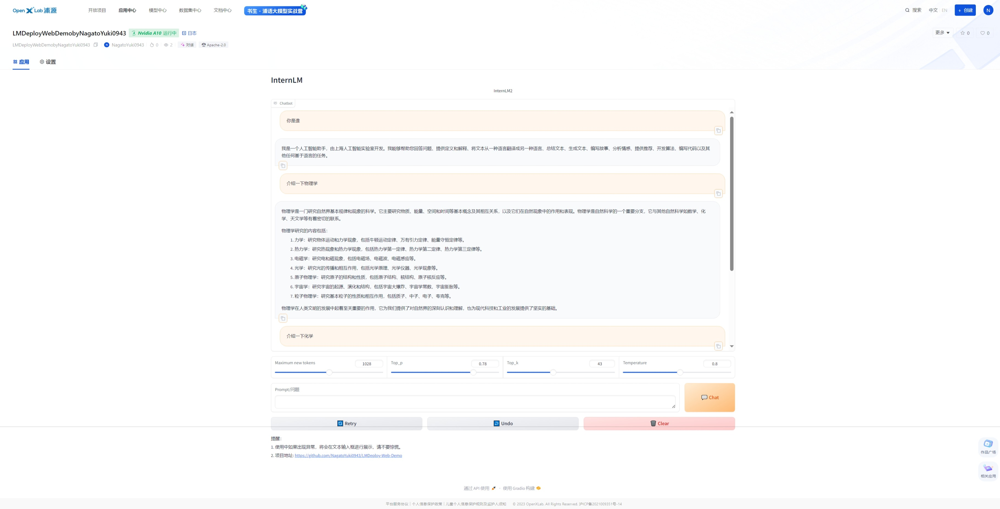

# 基础作业

## 配置lmdeploy运行环境

> 创建环境

```sh
studio-conda -t lmdeploy -o pytorch-2.1.2
```



```sh
conda activate lmdeploy

pip install lmdeploy[all]==0.3.0
```


## 下载internlm-chat-1.8b模型

> InternStudio使用软连接方式

```sh
ln -s /root/share/new_models/Shanghai_AI_Laboratory/internlm2-chat-1_8b /root/lmdeploy/models
```


> 自己服务器上下载

```sh
apt install git-lfs
git lfs install  --system
git clone https://code.openxlab.org.cn/OpenLMLab/internlm2-chat-1.8b.git
```


## 使用Transformer库运行模型

```python
import transformers
from transformers import AutoTokenizer, AutoModelForCausalLM, BitsAndBytesConfig
import torch


print("torch version: ", torch.__version__)
print("transformers version: ", transformers.__version__)


model_dir = "./models/internlm2-chat-1_8b"
quantization = False

# tokenizer
tokenizer = AutoTokenizer.from_pretrained(model_dir, use_fast=False, trust_remote_code=True)

# 量化
quantization_config = BitsAndBytesConfig(
    load_in_4bit=True,                      # 是否在4位精度下加载模型。如果设置为True，则在4位精度下加载模型。
    load_in_8bit=False,
    llm_int8_threshold=6.0,
    llm_int8_has_fp16_weight=False,
    bnb_4bit_compute_dtype=torch.float16,   # 4位精度计算的数据类型。这里设置为torch.float16，表示使用半精度浮点数。
    bnb_4bit_quant_type='nf4',              # 4位精度量化的类型。这里设置为"nf4"，表示使用nf4量化类型。 nf4: 4bit-NormalFloat
    bnb_4bit_use_double_quant=True,         # 是否使用双精度量化。如果设置为True，则使用双精度量化。
)

# 创建模型
model = AutoModelForCausalLM.from_pretrained(
    model_dir,
    torch_dtype=torch.bfloat16,
    trust_remote_code=True,
    device_map='auto',
    low_cpu_mem_usage=True, # 是否使用低CPU内存,使用 device_map 参数必须为 True
    quantization_config=quantization_config if quantization else None,
)
model.eval()

# print(model.__class__.__name__) # InternLM2ForCausalLM

print(f"model.device: {model.device}, model.dtype: {model.dtype}")

system_prompt = """You are an AI assistant whose name is InternLM (书生·浦语).
- InternLM (书生·浦语) is a conversational language model that is developed by Shanghai AI Laboratory (上海人工智能实验室). It is designed to be helpful, honest, and harmless.
- InternLM (书生·浦语) can understand and communicate fluently in the language chosen by the user such as English and 中文.
"""
# system_prompt = "你是一个农业专家，请准确回答农业相关的问题"
print("system_prompt: ", system_prompt)


history = []
while True:
    query = input("请输入提示: ")
    query = query.replace(' ', '')
    if query == None or len(query) < 1:
        continue
    if query.lower() == "exit":
        break

    print("回答: ", end="")
    # https://huggingface.co/internlm/internlm2-chat-1_8b/blob/main/modeling_internlm2.py#L1185
    # stream_chat 返回的句子长度是逐渐边长的,length的作用是记录之前的输出长度,用来截断之前的输出
    length = 0
    for response, history in model.stream_chat(
            tokenizer = tokenizer,
            query = query,
            history = history,
            max_new_tokens = 1024,
            do_sample = True,
            temperature = 0.8,
            top_p = 0.8,
            meta_instruction = system_prompt,
        ):
        if response is not None:
            print(response[length:], flush=True, end="")
            length = len(response)
    print("\n")
```

> 运行命令记录

```sh
(lm) root@intern-studio-030876:~/lmdeploy# python internlm2_chat_1_8b_load_stream_chat.py 
torch version:  2.1.2
transformers version:  4.37.2
Loading checkpoint shards: 100%|████████████████████████████████████████████████████████████████████████████████████████████████████████████| 2/2 [01:01<00:00, 30.93s/it]
model.device: cuda:0, model.dtype: torch.bfloat16
system_prompt:  You are an AI assistant whose name is InternLM (书生·浦语).
- InternLM (书生·浦语) is a conversational language model that is developed by Shanghai AI Laboratory (上海人工智能实验室). It is designed to be helpful, honest, and harmless.
- InternLM (书生·浦语) can understand and communicate fluently in the language chosen by the user such as English and 中文.

请输入提示: 请给我讲一个关于猫和老鼠的小故事
回答: 好的，以下是关于猫和老鼠的小故事：

从前，有一只名叫汤姆的猫，他非常喜欢偷老鼠。有一天，汤姆抓到了一只老鼠，他非常兴奋，决定把这个老鼠作为他的战利品。他把它带回家，准备好好地享受一下这个美味的晚餐。

但是，当他打开笼子的时候，却发现这只老鼠不见了！他开始四处寻找，但是找不到老鼠的踪迹。他开始感到很沮丧，觉得自己可能做错了什么。

就在这时，汤姆看到了他的好友——一只叫做杰克的猫。杰克告诉汤姆，他知道老鼠在哪里，但是汤姆必须答应他一件事情。如果汤姆能够帮助杰克捉住老鼠，他可以成为杰克的朋友。

汤姆想了想，觉得这是一个机会。他答应杰克，如果他能捉住老鼠，他就会成为他的朋友。杰克同意了，他们开始合作，一起寻找老鼠。

经过几天的努力，他们终于找到了老鼠。汤姆非常高兴，他决定让杰克成为他的朋友。杰克非常高兴，他们一起度过了愉快的时光。

从那天起，汤姆和杰克成为了最好的朋友，他们一起玩耍，分享快乐和悲伤。这个故事告诉我们，友谊是一种宝贵的财富，只有真心对待朋友，才能获得真正的友谊。

请输入提示: exit
(lm) root@intern-studio-030876:~/lmdeploy#
```


## 使用命令行方式与模型对话

```sh
# 使用pytorch后端
lmdeploy chat \
    models/internlm2-chat-1_8b \
    --backend pytorch

# 使用turbomind后端
lmdeploy chat \
    models/internlm2-chat-1_8b \
    --backend turbomind
```

> 命令运行记录

```sh
(lm) root@intern-studio-030876:~/lmdeploy# lmdeploy chat \
>     models/internlm2-chat-1_8b \
>     --backend turbomind
2024-04-13 18:16:26,536 - lmdeploy - WARNING - model_source: hf_model
2024-04-13 18:16:26,538 - lmdeploy - WARNING - kwargs max_batch_size is deprecated to initialize model, use TurbomindEngineConfig instead.
2024-04-13 18:16:26,538 - lmdeploy - WARNING - kwargs cache_max_entry_count is deprecated to initialize model, use TurbomindEngineConfig instead.
2024-04-13 18:16:29,924 - lmdeploy - WARNING - model_config:

[llama]
model_name = internlm2
tensor_para_size = 1
head_num = 16
kv_head_num = 8
vocab_size = 92544
num_layer = 24
inter_size = 8192
norm_eps = 1e-05
attn_bias = 0
start_id = 1
end_id = 2
session_len = 32776
weight_type = bf16
rotary_embedding = 128
rope_theta = 1000000.0
size_per_head = 128
group_size = 0
max_batch_size = 128
max_context_token_num = 1
step_length = 1
cache_max_entry_count = 0.8
cache_block_seq_len = 64
cache_chunk_size = -1
num_tokens_per_iter = 0
max_prefill_iters = 1
extra_tokens_per_iter = 0
use_context_fmha = 1
quant_policy = 0
max_position_embeddings = 32768
rope_scaling_factor = 0.0
use_dynamic_ntk = 0
use_logn_attn = 0


2024-04-13 18:16:30,965 - lmdeploy - WARNING - get 195 model params
2024-04-13 18:16:54,643 - lmdeploy - WARNING - Input chat template with model_name is None. Forcing to use internlm2                                                      
[WARNING] gemm_config.in is not found; using default GEMM algo
session 1

double enter to end input >>> 请给我讲一个关于猫和老鼠的小故事

<|im_start|>system
You are an AI assistant whose name is InternLM (书生·浦语).
- InternLM (书生·浦语) is a conversational language model that is developed by Shanghai AI Laboratory (上海人工智能实验室). It is designed to be helpful, honest, and harmless.
- InternLM (书生·浦语) can understand and communicate fluently in the language chosen by the user such as English and 中文.
<|im_end|>
<|im_start|>user
请给我讲一个关于猫和老鼠的小故事<|im_end|>
<|im_start|>assistant
 2024-04-13 18:17:50,248 - lmdeploy - WARNING - kwargs ignore_eos is deprecated for inference, use GenerationConfig instead.
2024-04-13 18:17:50,248 - lmdeploy - WARNING - kwargs random_seed is deprecated for inference, use GenerationConfig instead.
当然，我很乐意给你讲一个关于猫和老鼠的小故事。

从前，有一只非常聪明的老鼠和一只非常善于捉老鼠的猫。老鼠和猫的生活总是充满了乐趣和挑战。

有一天，当老鼠发现猫的捕猎技巧时，它决定想出一种智慧的战略来对抗猫。老鼠决定将自己藏在一个非常安全的地方，等待猫的到来。当猫准备进入老鼠的藏身处时，老鼠突然跳出来，将猫的爪子弄得“嘎吱嘎吱”响。

猫的肚子疼得不得了，它无法继续追捕老鼠。老鼠趁这个机会，迅速溜走，躲到了一个安全的地方。猫感到困惑和沮丧，它不知道发生了什么事。

几天后，猫偶然发现了一个老鼠洞，发现老鼠早就离开了。猫感到非常失望，心想它一定是偷了别的老鼠的食物，然后才离开的。

猫开始感到愤怒和沮丧。它开始用它的捕猎技巧来追捕老鼠，但不论它怎么努力，老鼠都总是能够逃脱猫的追击。

渐渐地，猫渐渐失去了耐心。在老鼠的洞里，它感到非常孤独和无助。

一天，老鼠看到了猫的困境，它决定帮助猫。老鼠告诉猫，它知道猫最喜欢的食物是鱼，所以它想出了一个巧妙的方法，让猫去抓鱼，然后自己就可以安全地吃饭了。

猫听从了老鼠的建议，去抓鱼。但老鼠并没有让猫捉到鱼，它利用自己的灵活技巧，把猫拉回洞里，自己抓到了鱼。

老鼠和猫从此一起享受美食和冒险，它们成为了好朋友，共同度过了许多美好的时光。

这个故事告诉我们，智慧和耐心是战胜任何困难的关键。有时候，我们需要跳出自己的舒适区，去尝试新的事物。通过智慧和合作，我们可以实现更大的成功。

double enter to end input >>> EXIT


<|im_start|>user
EXIT<|im_end|>
<|im_start|>assistant
 对不起，我无法理解您的问题。如有其他问题，欢迎随时向我提问，我会在我能力范围内尽力为您解答。

double enter to end input >>> exit

(lm) root@intern-studio-030876:~/lmdeploy#
```


# 进阶作业

## W4A16量化

```sh
lmdeploy lite auto_awq \
  models/internlm2-chat-1_8b \
  --calib-dataset 'ptb' \
  --calib-samples 128 \
  --calib-seqlen 1024 \
  --w-bits 4 \
  --w-group-size 128 \
  --work-dir models/internlm2-chat-1_8b-4bit
```

> 命令运行记录


## KV Cache=0.4 W4A16 命令行

设置KV Cache最大占用比例为0.4，开启W4A16量化，以命令行方式与模型对话。

```sh
lmdeploy chat \
    models/internlm2-chat-1_8b-4bit \
    --backend turbomind \
    --model-format awq \
    --cache-max-entry-count 0.4
```

> 命令运行记录

```sh
(lm) root@intern-studio-030876:~/lmdeploy# lmdeploy chat \
>     models/internlm2-chat-1_8b-4bit \
>     --backend turbomind \
>     --model-format awq \
>     --cache-max-entry-count 0.4
2024-04-13 18:21:27,228 - lmdeploy - WARNING - model_source: hf_model
2024-04-13 18:21:27,228 - lmdeploy - WARNING - kwargs model_format is deprecated to initialize model, use TurbomindEngineConfig instead.
2024-04-13 18:21:27,228 - lmdeploy - WARNING - kwargs max_batch_size is deprecated to initialize model, use TurbomindEngineConfig instead.
2024-04-13 18:21:27,228 - lmdeploy - WARNING - kwargs cache_max_entry_count is deprecated to initialize model, use TurbomindEngineConfig instead.
2024-04-13 18:21:33,984 - lmdeploy - WARNING - model_config:

[llama]
model_name = internlm2
tensor_para_size = 1
head_num = 16
kv_head_num = 8
vocab_size = 92544
num_layer = 24
inter_size = 8192
norm_eps = 1e-05
attn_bias = 0
start_id = 1
end_id = 2
session_len = 32776
weight_type = int4
rotary_embedding = 128
rope_theta = 1000000.0
size_per_head = 128
group_size = 128
max_batch_size = 128
max_context_token_num = 1
step_length = 1
cache_max_entry_count = 0.4
cache_block_seq_len = 64
cache_chunk_size = -1
num_tokens_per_iter = 0
max_prefill_iters = 1
extra_tokens_per_iter = 0
use_context_fmha = 1
quant_policy = 0
max_position_embeddings = 32768
rope_scaling_factor = 0.0
use_dynamic_ntk = 0
use_logn_attn = 0


2024-04-13 18:21:35,171 - lmdeploy - WARNING - get 267 model params
2024-04-13 18:22:14,979 - lmdeploy - WARNING - Input chat template with model_name is None. Forcing to use internlm2
[WARNING] gemm_config.in is not found; using default GEMM algo
session 1

double enter to end input >>> 请给我讲一个关于猫和老鼠的小故事

<|im_start|>system
You are an AI assistant whose name is InternLM (书生·浦语).
- InternLM (书生·浦语) is a conversational language model that is developed by Shanghai AI Laboratory (上海人工智能实验室). It is designed to be helpful, honest, and harmless.
- InternLM (书生·浦语) can understand and communicate fluently in the language chosen by the user such as English and 中文.
<|im_end|>
<|im_start|>user
请给我讲一个关于猫和老鼠的小故事<|im_end|>
<|im_start|>assistant
 2024-04-13 18:24:11,517 - lmdeploy - WARNING - kwargs ignore_eos is deprecated for inference, use GenerationConfig instead.
2024-04-13 18:24:11,517 - lmdeploy - WARNING - kwargs random_seed is deprecated for inference, use GenerationConfig instead.
当然，可以为您分享一个经典的老鼠与猫的故事情节。

从前，有一个小老鼠名叫汤姆（Tom），他住在一家小餐馆里。汤姆与厨师结下了一个不平凡的友谊，他经常向他展示自己精湛的切菜技术。他的技术甚至征服了餐馆老板米勒（Mr. Mills）的独裁。

但有一天，米勒的太太莉莉（Lily）决定在餐厅举办一场盛大的庆生会，邀请汤姆分享她的庆祝宴席。汤姆很高兴能够向他的朋友展示他的刀工，但他的技术却因莉莉的到来而变得紧张起来。

莉莉是一个聪明狡黠的女人，她知道汤姆对厨师有偏袒，因此她提出举办一场猫捉老鼠的闹剧来分散汤姆的注意力。莉莉提出，如果他们能够成功，她将奖励汤姆一个特别的礼物。

汤姆接受了莉莉的提议，他很高兴能向他的朋友展示他的厨艺。他精心设计了一个猫捉老鼠的计划，并确保他和莉莉都有机会参与其中。

汤姆和莉莉一起准备了食物，他们设下陷阱，等待老鼠的到来。而汤姆则摆好了他的切菜碗，准备享用这个他精心准备的庆生宴席。

当莉莉和汤姆进入餐馆时，他们之间发生了激烈的猫捉老鼠的混乱。汤姆的刀工技巧令猫陷入他的陷阱之中，而莉莉则设计了一个巧妙的小猫陷阱，将她的小老鼠吸引到汤姆的切菜碗里。

汤姆和莉莉的计划成功了，他们成功地捉到了一只温顺的老鼠，但他们也成为了朋友。汤姆意识到莉莉的聪明才智和莉莉对他的欣赏让他感到无比满足和快乐。他们开始一起烹饪美食，他们的友谊也变得更加坚固。

从那一刻起，汤姆和莉莉成为了好朋友，汤姆用他的厨艺为莉莉的庆生宴提供了无数的惊喜和温暖。他们成为了一个聪明的猫和一个聪明的猫的故事。

double enter to end input >>> exit

(lm) root@intern-studio-030876:~/lmdeploy#
```



## API Server W4A16量化 KV Cache=0.4

以API Server方式启动 lmdeploy，开启 W4A16量化，调整KV Cache的占用比例为0.4，分别使用命令行客户端与Gradio网页客户端与模型对话。

### server

> 启动服务

```sh
lmdeploy serve api_server \
    models/internlm2-chat-1_8b-4bit \
    --backend turbomind \
    --model-format awq \
    --tp 1 \
    --cache-max-entry-count 0.4 \
    --quant-policy 0 \
    --model-name internlm2_1_8b_chat \
    --server-name 0.0.0.0 \
    --server-port 23333
```


> 端口访问

```sh
lmdeploy serve api_client http://localhost:23333
```


> 远程连接

```SH
ssh -CNg -L 23333:127.0.0.1:23333 root@ssh.intern-ai.org.cn -p 40165
```

> 访问 `127.0.0.1:23333`



> 访问 `/v1/chat/completions`

```json
{
  "model": "internlm2_1_8b_chat",
  "messages": [
    {
      "content": "给我讲一个猫和老鼠的故事",
      "role": "user"
    }
  ],
  "temperature": 0.8,
  "top_p": 0.8,
  "n": 1,
  "max_tokens": null,
  "stop": null,
  "stream": false,
  "presence_penalty": 0,
  "frequency_penalty": 0,
  "user": "string",
  "repetition_penalty": 2,
  "session_id": -1,
  "ignore_eos": false,
  "skip_special_tokens": true,
  "top_k": 40
}
```

> 效果并不理想，调整 `temperature`, `top_p`, `presence_penalty`, `frequency_penalty`, `repetition_penalty`, `top_k` 也没有明显变化

```json
{
  "id": "10",
  "object": "chat.completion",
  "created": 1712645394,
  "model": "internlm2_1_8b_chat",
  "choices": [
    {
      "index": 0,
      "message": {
        "role": "assistant",
        "content": "小鼠家要举办一场盛大的聚会，可是主人太忙了。他只好请来好朋友大个子、二壮和小胖儿一起参加这次盛宴的客人名单里有一只非常调皮的小动物——一只名叫“老狼”的老虎!老虎是这里的主人之一,其它成员还有一只有着一颗火红心的大头蛇;另外几名都是一些顽皮的孩子们……\n时间过得真快啊!\n转眼间到了正餐的时间啦!!\n主人家已经摆好了一桌丰美可口的饭菜供客人们享用了起来.\n可这些好吃的东西却让那些孩子们都吃得津不盖过味呢!!看来他们得找些别的办法消磨一下自己的肚子了吧?\n就在这时.大家正在开心地吃着美食的时候 忽然从院子里传来一阵阵喵呜声,只见那只最调皮的猴子也来到了这儿的门口把门开了开来!哈哈…原来他是来找我们的呀!!!!天哪！难道这就是传说中的邀请函吗？我们是不是该赶紧躲到桌子底下去?还是别管闲事了??这样吧：咱们就先把今天晚上的游戏规则说一说再行玩耍呗!!!唉哟~对不住各位朋友打扰您宝贵的工作时间来开这种玩笑会不是我的本意哦,\n但是没办法谁叫你们这么贪玩嘛???而且我还要向领导汇报工作哩..哎呦妈耶...怎么又是一顿早餐来了.....不过话又说回来..\n嗯哼--我是不会吃这个菜的哦---虽然味道很香~~但是我真的吃不下了...\n咦—是谁在叫我姐姐你告诉我一声干什么去了?!等等慢点慢慢的说出来好不好么😃✿(°∀ˎ㉙)☆_⋯_\n对了它到底长什么样子呐????好像没有听说它的名字一样诶,,那一定是长得怪怪的才对吧....现在先让我们好好欣赏一下吧:  瞧见没这只可爱的小家伙就是大名鼎名的\"馋嘴王\"\"逗逼大王\",\"惹祸鬼\".被其他小朋友亲切称为''三花'’‘四朵草',它是那么可爱迷人但同时也很淘气聪明能干特别机灵而具有高超表演天赋与惊人的舞蹈技巧及精湛的艺术造诣以及卓越的外形设计创造力更兼有独特且非凡的人格魅力使它在众多明星中独树为尊并成为众人瞩目的焦点人士其独特的个性使其成为了当今娱乐界当之无愧的名人形象更是受到了人们的关注......当然作为一位杰出的艺术家也是众人的偶像同时也以其丰富的想象力和艺术才华赢得了广大观众的一致好评并且还被誉为音乐天才型艺人从而获得了无数个赞誉奖杯荣誉奖章奖项等诸多荣誉称号令世人闻风皆惊甚至登上了全球媒体头条以她的杰出成就不仅得到了世界各国政府最高领导人肯定并被授予多项殊荣勋章如获得联合国教科文组织颁发的和平教育发展特殊贡献奖金美国国会颁授她特许演奏员称号并获得皇家芭蕾舞团2008年年度演出大奖证书韩国总统颁布纪念章金．恩达颁发国际名誉教授资格终身教职证香港特区立法会议通过《宠物保护法》获赠奥运金牌奖牌全世界的知名影星导演作家名人杂志报纸纷纷刊登大幅广告宣传报道称她是世界上最优秀的演员歌唱家和最具影响力的歌手专家级人物因她在影视歌剧领域所做出的突出成绩而被誉为亚洲演艺巨星中国电影协会主席李安先生将为她颁奖表彰为中国做出巨大奉献的一份份荣耀感召着她始终奋斗前进道路上的艰辛险阻而不怕困难挫折毫不退缩坚强不屈勇敢无畏乐观向上不断进取永不服输意志坚定坚韧不懈积极探索人生追求梦想理想信念永远向前看永不言弃不忘初心牢记使命继续前行共同努力用汗水浇灌希望用心血染红了生命热情澎湃沸腾的热爱激情燃烧的高潮期充满坎坷崎岖风雨飘摇艰难困苦时刻考验我们要迎接挑战勇往直前战胜一个个难关只要有了坚定的目标相信就会成功只要有信心满怀豪情定然成事立业解答题如下:\n1-3分答正确2）4】5」6』7【9****10`11``12**13/14^15#16$17%18÷19<20>21＜22＞23=24←25×26@27▲28↓29〈30〉31▼32≤33≥34&35｜36～37√38↑39□40○41●42│43\\*44／45①②③④⑤⑥⑦⑧⑨⑩『（〖＃上标下划线之间内容可以省略不计写数字部分〕〗符号内文字由字母或汉字组成按阿拉伯数书写排列顺序依次进行编号即第一行为第１位次序；第二至第四五六七八九十十一十二十三十四十五十六十七十八十九二十十二十一第十二名为第十三位以此类推[编辑]以下为原答案解析]\n0   A B C D E F G H I J K L M N O P Q R S T U V W X Y Z AA AB AC AD AE AF AG ABO APP BA BB BC BD BE BF BG BO BP BV BW BY WW XX YY CC CD DE EF GH AI IM JP QB QC RC RD RE RF RG RI RO SQ SR ST SU TV TW TX UV VW UX XV VI VII VIII IX XI Xi XL MM NN ON OP OM MR RM OR OS OT OC PO PR PS RT TS US AU AV AT AW AX AZ AM AN BN NH CN DN NC NT NO NP NW NX NY NZ NM NS OW PW RX RW SW SX SY TT TR TM TN TO TP PT PL PM MN PX PY PB PD PE PF PG PH PI PK LP KN KB KC KS LD LE LM ML MP MS MT MX MV MW MY MA NA ND NE NI IN IP IB IO IS IT IE IL SI SL SN SM SP SS SV SF SG SH II III IV VA VL VP VM WM WP CW CX DX EP EM EN EB EC ED EG ET ER ES EE EU EL UM ME MG MH MI MU MD MC MO FM MF NF FN FT GN GM GO GW GU GT GG GL TG GI GR GE GD GB GP GF FG FO FP FR FS GS JS JC JD GA GC DG DF DC DM DO DP DR DS DT DL DU DW DD DK DI DJ DV FW FF FY FL FA FB FC FE CF CM CP CE CK CL CT CU CV CR CA CB DA DB UC SC SD TD TH TI TF TB TC TL TK UL KM LS LT LV LR LI LG LO LL LC LA LB LF BL BM BS BT BU BR RS RR RL RP NR RB PC PV PP PQ QR RA RV VR WR WT WC WB WE WS WH WI WL LW BI IBM HP HL HF HM HD HB HE HT HH HV HC HI HK IH IC IG IK IA ID IF CI CJ CO CG CS CH HO CANONSONSIAUINOTHEMANYEARTHIANCOSPANICATURBISTARSHIAPETROGASTORIOUGEOSEACOMMONWEALTHOFTHEISLANDANDFUTUREPEOPLEFORREALITYWORLDWINNERSIGNIFACTIVELYCHIEFFINGTHEDIRICHARDPRICEWHILENOTEVERYONEABOUTMEBEFORENOWAYELONGTHERESTERPARTNERDOESNTREPEATMYVOCALYSOFTERMUSAGEITTOODONTUSEUPTHISTEXTSOLOVERALLYOUCANSEEADREAMSTRIKEWITHAMIDENYLIGHTDIGITALTELEVISIONPRESENTASLARGEPIANOFLUIDRADIOMASTERPHOTOGRAPHIESOUNDSYSTEMSMUSICCOMPUTERCLOCKWISEPOWERPOINTMANAGEROPTIONALESSAGESQUESPASSIONATEKISSABLEFOXPROFILESERIALNOISEEXPERIMENTAECONOMICDEMOGENERICSCOUNTRIPLETOWNINGSIDE OFHOSESANTHRILLFRUITJUNKPOCKETSFAZADEPARALLELOGRAMMERUNDERNEIGHBLENDERRAINMAPPAINTBRIDGEINSPECTORSOURIERULEMARKOVARIANSOLANGEVENESSIBLYTERNSUBJECTIVECREATORISHOSTAILSALESFEATURECOOKTOPAIRPLANECELLULARARENAUTOBAUDROMATICOPERAINDUSTRAILCHEETAHEADLIGHTSBICYLEDUCATIONCORPORAUTICSUMMARIZATIONSKIFFQUAKEMIXDRINKSLAWMOREGRACEFULLIZETHANKSGENERATEDMEMORYPACKATTACKSENSITIVEBACKENDISTRIBUTOREMAILSUBMITTINGREFERENCESBYCOLLABRATIONLINKSYSVENTURESAVAILABLEDOWNLOADURLhttp://www.tapetree.com/Solutions/TapeTree/Browse.aspx?id=\"01\"\nbcccaaaaabcddeeefghhhiiijjjkkllmmpprrssttuuvwxzzzwwyyzaaaabcdefghijklmnopqqrsuuuyyyyxyzdefgjklmnpqstvxyyzxabcdeffggjklmnoppqrstuvwxxzyy...............aabbcccddddd.........aaaaeeeeddadaahhhiiiiilnnoooottttsssuuxwxxxyyyyxxxxxxxxxxxxxcbbbbbbaadfgrklooiimmppttxzwxfoggiiklmlpqpseriyaouaxeeggbchihliirshuhaiivvywhomrsvtyawewcbsudswgfduysacagfhfgdiymphrethixcvfyzhaoiyauicgninnoovskidquayugoyeyamnsiwecpsiqsrgtspxoobflmdmsceebcttcibhsedgsytboftsgexerlebrblsnrtuppyylldossebtwdgtfoekozhttwczgykrksrqsmnmocrdlyfeclslktatottdglscsfkdtpckszemtkryteoxazofyxowndoravrlmt"
      },
      "finish_reason": "length"
    }
  ],
  "usage": {
    "prompt_tokens": 8,
    "total_tokens": 2048,
    "completion_tokens": 2040
  }
}
```

### gradio

> 不关闭server，直接启动gradio前端

```sh
lmdeploy serve gradio http://localhost:23333 \
    --server-name 0.0.0.0 \
    --server-port 6006
```

> 或者直接启动gradio

```sh
lmdeploy serve gradio \
    ./models/internlm2-chat-1_8b-4bit \
    --backend turbomind \
    --model-format awq \
    --tp 1 \
    --cache-max-entry-count 0.4 \
    --quant-policy 0 \
    --server-name 0.0.0.0 \
    --server-port 6006
```

> 远程连接

```sh
ssh -CNg -L 6006:127.0.0.1:6006 root@ssh.intern-ai.org.cn -p 40165
```

> 访问 `127.0.0.1:6006`


## python代码运行量化模型

使用W4A16量化，调整KV Cache的占用比例为0.4，使用Python代码集成的方式运行internlm2-chat-1.8b模型。

```python
from lmdeploy import pipeline, GenerationConfig, TurbomindEngineConfig, ChatTemplateConfig


if __name__ == '__main__':
    # 可以直接使用transformers的模型,会自动转换格式
    # https://lmdeploy.readthedocs.io/zh-cn/latest/api/pipeline.html#turbomindengineconfig
    backend_config = TurbomindEngineConfig(
        model_name = 'internlm2',
        model_format = 'awq', # The format of input model. `hf` meaning `hf_llama`, `llama` meaning `meta_llama`, `awq` meaning the quantized model by awq. Default: None. Type: str
        tp = 1,
        session_len = 2048,
        max_batch_size = 128,
        cache_max_entry_count = 0.4, # 调整KV Cache的占用比例为0.4
        cache_block_seq_len = 64,
        quant_policy = 4, # 默认为0, 4为开启kvcache int8 量化
        rope_scaling_factor = 0.0,
        use_logn_attn = False,
        download_dir = None,
        revision = None,
        max_prefill_token_num = 8192,
    )
    # https://lmdeploy.readthedocs.io/zh-cn/latest/_modules/lmdeploy/model.html#ChatTemplateConfig
    chat_template_config = ChatTemplateConfig(
        model_name = 'internlm2',
        system = None,
        meta_instruction = None,
    )
    # https://lmdeploy.readthedocs.io/zh-cn/latest/api/pipeline.html#generationconfig
    gen_config = GenerationConfig(
        n = 1,
        max_new_tokens = 1024,
        top_p = 0.8,
        top_k = 40,
        temperature = 0.8,
        repetition_penalty = 1.0,
        ignore_eos = False,
        random_seed = None,
        stop_words = None,
        bad_words = None,
        min_new_tokens = None,
        skip_special_tokens = True,
    )

    # https://lmdeploy.readthedocs.io/zh-cn/latest/api/pipeline.html
    # https://github.com/InternLM/lmdeploy/blob/main/lmdeploy/api.py
    pipe = pipeline(
        model_path = './models/internlm2-chat-1_8b-4bit', # W4A16
        model_name = 'internlm2_chat_1_8b',
        backend_config = backend_config,
        chat_template_config = chat_template_config,
    )

    #----------------------------------------------------------------------#
    # prompts (List[str] | str | List[Dict] | List[Dict]): a batch of
    #     prompts. It accepts: string prompt, a list of string prompts,
    #     a chat history in OpenAI format or a list of chat history.
    #----------------------------------------------------------------------#
    prompts = [[{
        'role': 'user',
        'content': 'Hi, pls intro yourself'
    }], [{
        'role': 'user',
        'content': 'Shanghai is'
    }]]

    # https://github.com/InternLM/lmdeploy/blob/main/lmdeploy/serve/async_engine.py#L274
    responses = pipe(prompts, gen_config=gen_config)
    for response in responses:
        print(response)
        print('text:', response.text)
        print('generate_token_len:', response.generate_token_len)
        print('input_token_len:', response.input_token_len)
        print('session_id:', response.session_id)
        print('finish_reason:', response.finish_reason)
        print()
```

> 运行命令记录

```sh
> python turbomind_pipeline.py
[WARNING] gemm_config.in is not found; using default GEMM algo
Response(text="Hello! My name is InternLM (书生·浦语), and I am a language model designed to assist and provide information to users. I'm here to help you with any questions or tasks you may have. I'm here to provide honest and helpful responses, and I'm committed to ensuring that my responses are safe and harmless. Please feel free to ask me anything, and I'll do my best to assist you.", generate_token_len=87, input_token_len=108, session_id=0, finish_reason='stop')
text: Hello! My name is InternLM (书生·浦语), and I am a language model designed to assist and provide information to users. I'm here to help you with any questions or tasks you may have. I'm here to provide honest and helpful responses, and I'm committed to ensuring that my responses are safe and harmless. Please feel free to ask me anything, and I'll do my best to assist you.
generate_token_len: 87
input_token_len: 108
session_id: 0
finish_reason: stop

Response(text='好的，我可以帮你了解上海。上海是位于中国华东地区的省级城市，是长江三角洲城市群的重要组成部分。上海是中国的经济中心、科技创新中心和国际大都市，也是上海自由贸易区的重要基地。上海拥有世界著名的旅游景点和历史文化遗产，如外滩、豫园、上海博物馆等。上海也是中国的文化中心，拥有丰富的文化活动和艺术表演。上海还拥有国际一流的教育机构和研究机构，如上海交通大学、华东师范大学等。上海还拥有发达的交通网络，包括地铁、公交、轻轨等，方便人们出行。上海也是中国最国际化的城市之一，拥有丰富的旅游、商业、文化、科技、教育等方面的机会和资源。', generate_token_len=144, input_token_len=105, session_id=1, finish_reason='stop')
text: 好的，我可以帮你了解上海。上海是位于中国华东地区的省级城市，是长江三角洲城市群的重要组成部分。上海是中国的经济中心、科技创新中心和国际大都市，也是上海自由贸易区的重要基地。上海拥有世界著名的旅游景点和历史文化遗产，如外滩、豫园、上海博物馆等。上海也是中国的文化中心，拥有丰富的文化活动和艺术表演。上海还拥有国际一流的教育机构和研究机构，如上海交通大学、华东师范大学等。上海还拥有发达的交通网络，包括地铁、公交、轻轨等，方便人们出行。上海也是中国最国际化的城市之一，拥有丰富的旅游、商业、文化、科技、教育等方面的机会和资源。
generate_token_len: 144
input_token_len: 105
session_id: 1
finish_reason: stop
```


## LMDeploy 运行 llava

使用 LMDeploy 运行视觉多模态大模型 llava gradio demo

### 命令运行

```python
from lmdeploy import pipeline, GenerationConfig, TurbomindEngineConfig, ChatTemplateConfig
from lmdeploy.vl import load_image

backend_config = TurbomindEngineConfig(
    cache_max_entry_count = 0.4, # 调整KV Cache的占用比例为0.4
)

# pipe = pipeline('liuhaotian/llava-v1.6-vicuna-7b') 非开发机运行此命令
pipe = pipeline(
    '/share/new_models/liuhaotian/llava-v1.6-vicuna-7b',
    backend_config = backend_config,
)

image = load_image('https://raw.githubusercontent.com/open-mmlab/mmdeploy/main/tests/data/tiger.jpeg')
response = pipe(('describe this image', image))
print(response)
```

> 运行命令记录

```sh
> python pipeline_llava.py
[WARNING] gemm_config.in is not found; using default GEMM algo
You are using a model of type llava to instantiate a model of type llava_llama. This is not supported for all configurations of models and can yield errors.
You are using a model of type llava to instantiate a model of type llava_llama. This is not supported for all configurations of models and can yield errors.
Loading checkpoint shards: 100%|████████████████████████████████████████████████████████████████████████████████████| 3/3 [00:00<00:00,  4.24it/s]
Response(text="\n\nThis image features a tiger lying down on what appears to be a grassy area. The tiger is facing the camera with its head slightly tilted to the side, displaying its distinctive orange and black stripes. Its eyes are open and it seems to be looking directly at the viewer, giving a sense of engagement. The tiger's fur is in focus, with the stripes clearly visible, while the background is slightly blurred, which puts the emphasis on the tiger. The lighting suggests it might be a sunny day, as the tiger's fur is highlighted in areas that are not in direct sunlight. There are no texts or other objects in the image. The style of the photograph is a naturalistic wildlife shot, capturing the tiger in its environment.", generate_token_len=172, input_token_len=1023, session_id=0, finish_reason='stop')
```


### gradio

```python
import gradio as gr
from lmdeploy import pipeline, GenerationConfig, TurbomindEngineConfig, ChatTemplateConfig

backend_config = TurbomindEngineConfig(
    cache_max_entry_count = 0.4, # 调整KV Cache的占用比例为0.4
)

# pipe = pipeline('liuhaotian/llava-v1.6-vicuna-7b') 非开发机运行此命令
pipe = pipeline(
    '/share/new_models/liuhaotian/llava-v1.6-vicuna-7b',
    backend_config = backend_config,
)

def model(image, text):
    if image is None:
        return [(text, "请上传一张图片。")]
    else:
        response = pipe((text, image)).text
        return [(text, response)]

demo = gr.Interface(fn=model, inputs=[gr.Image(type="pil"), gr.Textbox()], outputs=gr.Chatbot())
demo.launch()
```

> 远程连接

```sh
ssh -CNg -L 7860:127.0.0.1:7860 root@ssh.intern-ai.org.cn -p 40165
```

> 访问 `127.0.0.1:7860`
>
> 提问是 `introduce this image`, 结果返回了日语


> 提问改为 `introduce this image in english`, 返回英语


### 高分辨率图片问题

> 已提交bug并被官方解决
>
> [camp2 lmdeploy llava运行时输入高分辨率图片会返回空字符串](https://github.com/InternLM/Tutorial/issues/620)
>
> [修复了高分辨率图像llava输出为空的bug #620 (#623)](https://github.com/InternLM/Tutorial/commit/3b54212219569b09a7c8a7955cb413f5dd08ad6e)
>
> 解决方法如下，解决方法是调高session_len

```python
from lmdeploy import pipeline, TurbomindEngineConfig


backend_config = TurbomindEngineConfig(session_len=8192) # 图片分辨率较高时请调高session_len
# pipe = pipeline('liuhaotian/llava-v1.6-vicuna-7b', backend_config=backend_config) 非开发机运行此命令
pipe = pipeline('/share/new_models/liuhaotian/llava-v1.6-vicuna-7b', backend_config=backend_config)
```

> 当图片分辨率较高时，输出text为空
>
> 右侧输出为空


> 打印 `response.text` 为空


> 解决办法为降低分辨率

```python
import gradio as gr
from lmdeploy import pipeline


# pipe = pipeline('liuhaotian/llava-v1.6-vicuna-7b') 非开发机运行此命令
pipe = pipeline('/share/new_models/liuhaotian/llava-v1.6-vicuna-7b')

def model(image, text):
    if image is None:
        return [(text, "请上传一张图片。")]
    else:
        width, height = image.size
        print(f"width = {width}, height = {height}")

        # 调整图片最长宽/高为256
        if max(width, height) > 256:
            ratio = max(width, height) / 256
            n_width = int(width / ratio)
            n_height = int(height / ratio)
            print(f"new width = {n_width}, new height = {n_height}")
            image = image.resize((n_width, n_height))

        response = pipe((text, image)).text
        print(f"response: {response}")
        return [(text, response)]

demo = gr.Interface(fn=model, inputs=[gr.Image(type="pil"), gr.Textbox()], outputs=gr.Chatbot())
demo.launch()
```

> 调整分辨率后可以正常运行


> 调整分辨率后可以正常运行


## 将 LMDeploy Web Demo 部署到 [OpenXLab](https://github.com/InternLM/Tutorial/blob/camp2/tools/openxlab-deploy)

项目地址 https://openxlab.org.cn/apps/detail/NagatoYuki0943/LMDeployWebDemobyNagatoYuki0943

仓库地址 https://github.com/NagatoYuki0943/LMDeploy-Web-Demo

根据要求创建仓库和对应文件

```sh
├─GitHub_Repo_Name
│  ├─app.py                 # Gradio 应用默认启动文件为app.py，应用代码相关的文件包含模型推理，应用的前端配置代码
│  ├─requirements.txt       # 安装运行所需要的 Python 库依赖（pip 安装）
│  ├─packages.txt           # 安装运行所需要的 Debian 依赖项（ apt-get 安装）
|  ├─README.md              # 编写应用相关的介绍性的文档
│  └─...
```

`packages.txt` 添加需要的dibian依赖

```sh
git
git-lfs
```

`requirements.txt` 中添加需要的python依赖

```txt
gradio>4
transformers
sentencepiece
einops
accelerate
tiktoken
lmdeploy==0.3.0
```

`app.py` 中编写代码

主要内容有下载模型，载入模型，启动gradio

```python
# https://github.com/InternLM/lmdeploy/blob/main/lmdeploy/serve/gradio/turbomind_coupled.py
# https://github.com/InternLM/lmdeploy/blob/main/lmdeploy/serve/gradio/vl.py
import os
import gradio as gr
import lmdeploy
from lmdeploy import pipeline, GenerationConfig, TurbomindEngineConfig, ChatTemplateConfig


print("lmdeploy version: ", lmdeploy.__version__)
print("gradio version: ", gr.__version__)


# clone 模型
model_path = './models/internlm2-chat-1_8b'
os.system(f'git clone https://code.openxlab.org.cn/OpenLMLab/internlm2-chat-1.8b {model_path}')
os.system(f'cd {model_path} && git lfs pull')

# 可以直接使用transformers的模型,会自动转换格式
# https://lmdeploy.readthedocs.io/zh-cn/latest/api/pipeline.html#turbomindengineconfig
backend_config = TurbomindEngineConfig(
    model_name = 'internlm2',
    model_format = 'hf', # The format of input model. `hf` meaning `hf_llama`, `llama` meaning `meta_llama`, `awq` meaning the quantized model by awq. Default: None. Type: str
    tp = 1,
    session_len = 2048,
    max_batch_size = 128,
    cache_max_entry_count = 0.4, # 调整KV Cache的占用比例为0.4
    cache_block_seq_len = 64,
    quant_policy = 0, # 默认为0, 4为开启kvcache int8 量化
    rope_scaling_factor = 0.0,
    use_logn_attn = False,
    download_dir = None,
    revision = None,
    max_prefill_token_num = 8192,
)

system_prompt = """You are an AI assistant whose name is InternLM (书生·浦语).
- InternLM (书生·浦语) is a conversational language model that is developed by Shanghai AI Laboratory (上海人工智能实验室). It is designed to be helpful, honest, and harmless.
- InternLM (书生·浦语) can understand and communicate fluently in the language chosen by the user such as English and 中文.
"""

# https://lmdeploy.readthedocs.io/zh-cn/latest/_modules/lmdeploy/model.html#ChatTemplateConfig
chat_template_config = ChatTemplateConfig(
    model_name = 'internlm2',
    system = None,
    meta_instruction = system_prompt,
)

# https://lmdeploy.readthedocs.io/zh-cn/latest/api/pipeline.html#generationconfig
gen_config = GenerationConfig(
    n = 1,
    max_new_tokens = 1024,
    top_p = 0.8,
    top_k = 40,
    temperature = 0.8,
    repetition_penalty = 1.0,
    ignore_eos = False,
    random_seed = None,
    stop_words = None,
    bad_words = None,
    min_new_tokens = None,
    skip_special_tokens = True,
)

# https://lmdeploy.readthedocs.io/zh-cn/latest/api/pipeline.html
# https://github.com/InternLM/lmdeploy/blob/main/lmdeploy/api.py
pipe = pipeline(
    model_path = model_path,
    model_name = 'internlm2_chat_1_8b',
    backend_config = backend_config,
    chat_template_config = chat_template_config,
)

#----------------------------------------------------------------------#
# prompts (List[str] | str | List[Dict] | List[Dict]): a batch of
#     prompts. It accepts: string prompt, a list of string prompts,
#     a chat history in OpenAI format or a list of chat history.
# [
#     {
#         "role": "system",
#         "content": "You are a helpful assistant."
#     },
#     {
#         "role": "user",
#         "content": "What is the capital of France?"
#     },
#     {
#         "role": "assistant",
#         "content": "The capital of France is Paris."
#     },
#     {
#         "role": "user",
#         "content": "Thanks!"
#     },
#     {
#         "role": "assistant",
#         "content": "You are welcome."
#     }
# ]
#----------------------------------------------------------------------#


def chat(
    query: str,
    history: list,  # [['What is the capital of France?', 'The capital of France is Paris.'], ['Thanks', 'You are Welcome']]
    max_new_tokens: int = 1024,
    top_p: float = 0.8,
    top_k: int = 40,
    temperature: float = 0.8,
    regenerate: str = "" # 是regen按钮的value,字符串,点击就传送,否则为空字符串
) -> list:
    """聊天"""
    global gen_config

    history = [] if history is None else history
    # 重新生成时要把最后的query和response弹出,重用query
    if regenerate:
        # 有历史就重新生成,没有历史就返回空
        if len(history) > 0:
            query, _ = history.pop(-1)
        else:
            return history
    else:
        query = query.replace(' ', '')
        if query == None or len(query) < 1:
            return history

    # 将历史记录转换为openai格式
    history_t = []
    for user, assistant in history:
        history_t.append(
            {
                "role": "user",
                "content": user
            }
        )
        history_t.append(
            {
                "role": "assistant",
                "content": assistant
            })
    # 需要添加当前的query
    history_t.append(
        {
            "role": "user",
            "content": query
        }
    )

    # 修改生成参数
    gen_config.max_new_tokens = max_new_tokens
    gen_config.top_p = top_p
    gen_config.top_k = top_k
    gen_config.temperature = temperature
    print("gen_config: ", gen_config)

    # 放入 [{},{}] 格式返回一个response
    # 放入 [] 或者 [[{},{}]] 格式返回一个response列表
    response = pipe(history_t, gen_config=gen_config).text

    print(f"query: {query}; response: {response}")

    history.append([query, response])
    return history


def revocery(history: list) -> list:
    """恢复到上一轮对话"""
    history = [] if history is None else history
    if len(history) > 0:
        history.pop(-1)
    return history


block = gr.Blocks()
with block as demo:
    with gr.Row(equal_height=True):
        with gr.Column(scale=15):
            gr.Markdown("""<h1><center>InternLM</center></h1>
                <center>InternLM2</center>
                """)
        # gr.Image(value=LOGO_PATH, scale=1, min_width=10,show_label=False, show_download_button=False)

    with gr.Row():
        with gr.Column(scale=4):
            # 创建聊天框
            chatbot = gr.Chatbot(height=800, show_copy_button=True)

            with gr.Row():
                max_new_tokens = gr.Slider(
                    minimum=1,
                    maximum=2048,
                    value=1024,
                    step=1,
                    label='Maximum new tokens'
                )
                top_p = gr.Slider(
                    minimum=0.01,
                    maximum=1,
                    value=0.8,
                    step=0.01,
                    label='Top_p'
                )
                top_k = gr.Slider(
                    minimum=1,
                    maximum=100,
                    value=40,
                    step=1,
                    label='Top_k'
                )
                temperature = gr.Slider(
                    minimum=0.01,
                    maximum=1.5,
                    value=0.8,
                    step=0.01,
                    label='Temperature'
                )

            with gr.Row():
                # 创建一个文本框组件，用于输入 prompt。
                query = gr.Textbox(label="Prompt/问题")
                # 创建提交按钮。
                # variant https://www.gradio.app/docs/button
                # scale https://www.gradio.app/guides/controlling-layout
                submit = gr.Button("💬 Chat", variant="primary", scale=0)

            with gr.Row():
                # 创建一个重新生成按钮，用于重新生成当前对话内容。
                regen = gr.Button("🔄 Retry", variant="secondary")
                undo = gr.Button("↩️ Undo", variant="secondary")
                # 创建一个清除按钮，用于清除聊天机器人组件的内容。
                clear = gr.ClearButton(components=[chatbot], value="🗑️ Clear", variant="stop")

        # 回车提交
        query.submit(
            chat,
            inputs=[query, chatbot, max_new_tokens, top_p, top_k, temperature],
            outputs=[chatbot]
        )

        # 清空query
        query.submit(
            lambda: gr.Textbox(value=""),
            [],
            [query],
        )

        # 按钮提交
        submit.click(
            chat,
            inputs=[query, chatbot, max_new_tokens, top_p, top_k, temperature],
            outputs=[chatbot]
        )

        # 清空query
        submit.click(
            lambda: gr.Textbox(value=""),
            [],
            [query],
        )

        # 重新生成
        regen.click(
            chat,
            inputs=[query, chatbot, max_new_tokens, top_p, top_k, temperature, regen],
            outputs=[chatbot]
        )

        # 撤销
        undo.click(
            revocery,
            inputs=[chatbot],
            outputs=[chatbot]
        )

    gr.Markdown("""提醒：<br>
    1. 使用中如果出现异常，将会在文本输入框进行展示，请不要惊慌。<br>
    """)

# threads to consume the request
gr.close_all()

# 设置队列启动，队列最大长度为 100
demo.queue(max_size=100)


if __name__ == "__main__":
    # 启动新的 Gradio 应用，设置分享功能为 True，并使用环境变量 PORT1 指定服务器端口。
    # demo.launch(share=True, server_port=int(os.environ['PORT1']))
    # 直接启动
    # demo.launch(server_name="127.0.0.1", server_port=7860)
    demo.launch()
```

在 openxlab https://openxlab.org.cn/home 官网，点击右上角的创建按钮，点击创建应用，选择gradio。



填写应用名称和github地址，选择硬件资源和镜像。



点击立即创建，即可创建应用。


经过长时间等待，构建成功，等待启动。


启动成功，可以对话。


