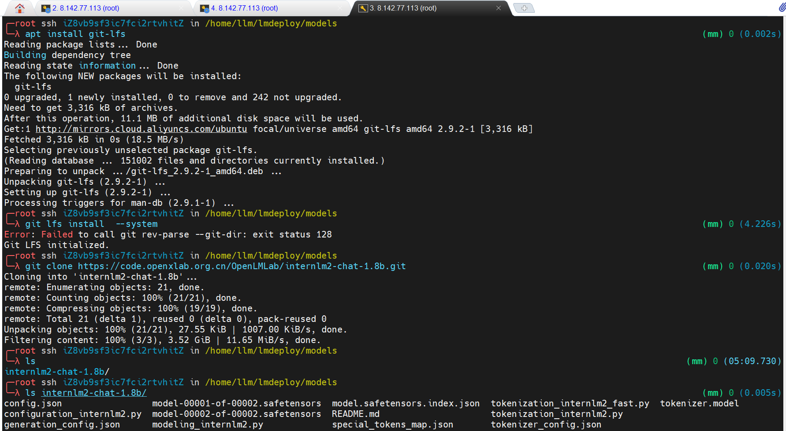
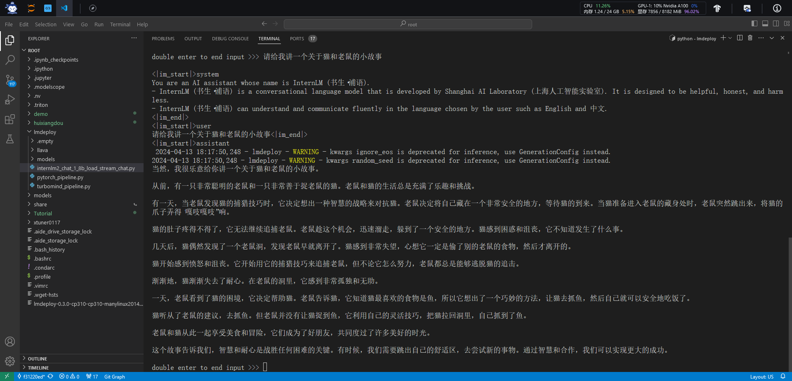
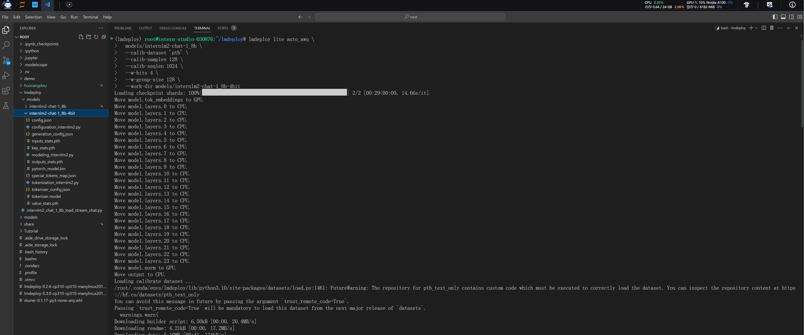
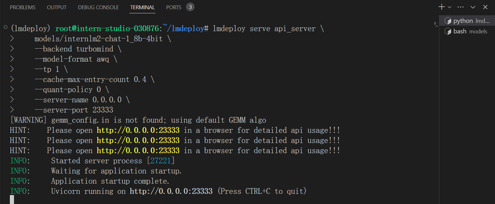
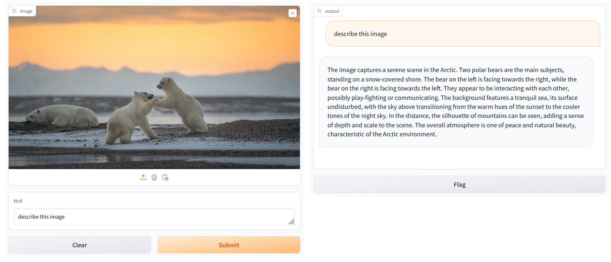

# 基础作业

## 配置lmdeploy运行环境

> 创建环境

```sh
studio-conda -t lmdeploy -o pytorch-2.1.2
```


```sh
conda activate lmdeploy

pip install lmdeploy[all]==0.3.0
```


## 下载internlm-chat-1.8b模型

> InternStudio使用软连接方式

```sh
ln -s /root/share/new_models/Shanghai_AI_Laboratory/internlm2-chat-1_8b /root/lmdeploy/models
```


> 自己服务器上下载

```sh
apt install git-lfs   
git lfs install  --system
git clone https://code.openxlab.org.cn/OpenLMLab/internlm2-chat-1.8b.git
```



## 使用Transformer库运行模型

```python
import transformers
from transformers import AutoTokenizer, AutoModelForCausalLM, BitsAndBytesConfig
import torch


print("torch version: ", torch.__version__)
print("transformers version: ", transformers.__version__)


model_dir = "./models/internlm2-chat-1_8b"
quantization = False

# tokenizer
tokenizer = AutoTokenizer.from_pretrained(model_dir, use_fast=False, trust_remote_code=True)

# 量化
quantization_config = BitsAndBytesConfig(
    load_in_4bit=True,                      # 是否在4位精度下加载模型。如果设置为True，则在4位精度下加载模型。
    load_in_8bit=False,
    llm_int8_threshold=6.0,
    llm_int8_has_fp16_weight=False,
    bnb_4bit_compute_dtype=torch.float16,   # 4位精度计算的数据类型。这里设置为torch.float16，表示使用半精度浮点数。
    bnb_4bit_quant_type='nf4',              # 4位精度量化的类型。这里设置为"nf4"，表示使用nf4量化类型。 nf4: 4bit-NormalFloat
    bnb_4bit_use_double_quant=True,         # 是否使用双精度量化。如果设置为True，则使用双精度量化。
)

# 创建模型
model = AutoModelForCausalLM.from_pretrained(
    model_dir,
    torch_dtype=torch.bfloat16,
    trust_remote_code=True,
    device_map='auto',
    low_cpu_mem_usage=True, # 是否使用低CPU内存,使用 device_map 参数必须为 True
    quantization_config=quantization_config if quantization else None,
)
model.eval()

# print(model.__class__.__name__) # InternLM2ForCausalLM

print(f"model.device: {model.device}, model.dtype: {model.dtype}")

system_prompt = """You are an AI assistant whose name is InternLM (书生·浦语).
- InternLM (书生·浦语) is a conversational language model that is developed by Shanghai AI Laboratory (上海人工智能实验室). It is designed to be helpful, honest, and harmless.
- InternLM (书生·浦语) can understand and communicate fluently in the language chosen by the user such as English and 中文.
"""
# system_prompt = "你是一个农业专家，请准确回答农业相关的问题"
print("system_prompt: ", system_prompt)


history = []
while True:
    query = input("请输入提示: ")
    query = query.replace(' ', '')
    if query == None or len(query) < 1:
        continue
    if query.lower() == "exit":
        break

    print("回答: ", end="")
    # https://huggingface.co/internlm/internlm2-chat-1_8b/blob/main/modeling_internlm2.py#L1185
    # stream_chat 返回的句子长度是逐渐边长的,length的作用是记录之前的输出长度,用来截断之前的输出
    length = 0
    for response, history in model.stream_chat(
            tokenizer = tokenizer,
            query = query,
            history = history,
            max_new_tokens = 1024,
            do_sample = True,
            temperature = 0.8,
            top_p = 0.8,
            meta_instruction = system_prompt,
        ):
        if response is not None:
            print(response[length:], flush=True, end="")
            length = len(response)
    print("\n")
```


## 使用命令行方式与模型对话

```sh
# 使用pytorch后端
lmdeploy chat \
    models/internlm2-chat-1_8b \
    --backend pytorch

# 使用turbomind后端
lmdeploy chat \
    models/internlm2-chat-1_8b \
    --backend turbomind
```



# 进阶作业

## W4A16量化

```sh
lmdeploy lite auto_awq \
  models/internlm2-chat-1_8b \
  --calib-dataset 'ptb' \
  --calib-samples 128 \
  --calib-seqlen 1024 \
  --w-bits 4 \
  --w-group-size 128 \
  --work-dir models/internlm2-chat-1_8b-4bit
```



## KV Cache=0.4 W4A16 命令行

设置KV Cache最大占用比例为0.4，开启W4A16量化，以命令行方式与模型对话。

```sh
lmdeploy chat \
    models/internlm2-chat-1_8b-4bit \
    --backend turbomind \
    --model-format awq \
    --cache-max-entry-count 0.4
```


## API Server W4A16量化 KV Cache=0.4

以API Server方式启动 lmdeploy，开启 W4A16量化，调整KV Cache的占用比例为0.4，分别使用命令行客户端与Gradio网页客户端与模型对话。

### server

> 启动服务

```sh
lmdeploy serve api_server \
    models/internlm2-chat-1_8b-4bit \
    --backend turbomind \
    --model-format awq \
    --tp 1 \
    --cache-max-entry-count 0.4 \
    --quant-policy 0 \
    --model-name internlm2_1_8b_chat \
    --server-name 0.0.0.0 \
    --server-port 23333
```



> 端口访问

```sh
lmdeploy serve api_client http://localhost:23333
```


> 远程连接

```SH
ssh -CNg -L 23333:127.0.0.1:23333 root@ssh.intern-ai.org.cn -p 42225
```

> 访问 `127.0.0.1:23333`


> 访问 `/v1/chat/completions`

```json
{
  "model": "internlm2_1_8b_chat",
  "messages": [
    {
      "content": "给我讲一个猫和老鼠的故事",
      "role": "user"
    }
  ],
  "temperature": 0.8,
  "top_p": 0.8,
  "n": 1,
  "max_tokens": null,
  "stop": null,
  "stream": false,
  "presence_penalty": 0,
  "frequency_penalty": 0,
  "user": "string",
  "repetition_penalty": 2,
  "session_id": -1,
  "ignore_eos": false,
  "skip_special_tokens": true,
  "top_k": 40
}
```

> 效果并不理想，调整 `temperature`, `top_p`, `presence_penalty`, `frequency_penalty`, `repetition_penalty`, `top_k` 也没有明显变化

```json
{
  "id": "10",
  "object": "chat.completion",
  "created": 1712645394,
  "model": "internlm2_1_8b_chat",
  "choices": [
    {
      "index": 0,
      "message": {
        "role": "assistant",
        "content": "小鼠家要举办一场盛大的聚会，可是主人太忙了。他只好请来好朋友大个子、二壮和小胖儿一起参加这次盛宴的客人名单里有一只非常调皮的小动物——一只名叫“老狼”的老虎!老虎是这里的主人之一,其它成员还有一只有着一颗火红心的大头蛇;另外几名都是一些顽皮的孩子们……\n时间过得真快啊!\n转眼间到了正餐的时间啦!!\n主人家已经摆好了一桌丰美可口的饭菜供客人们享用了起来.\n可这些好吃的东西却让那些孩子们都吃得津不盖过味呢!!看来他们得找些别的办法消磨一下自己的肚子了吧?\n就在这时.大家正在开心地吃着美食的时候 忽然从院子里传来一阵阵喵呜声,只见那只最调皮的猴子也来到了这儿的门口把门开了开来!哈哈…原来他是来找我们的呀!!!!天哪！难道这就是传说中的邀请函吗？我们是不是该赶紧躲到桌子底下去?还是别管闲事了??这样吧：咱们就先把今天晚上的游戏规则说一说再行玩耍呗!!!唉哟~对不住各位朋友打扰您宝贵的工作时间来开这种玩笑会不是我的本意哦,\n但是没办法谁叫你们这么贪玩嘛???而且我还要向领导汇报工作哩..哎呦妈耶...怎么又是一顿早餐来了.....不过话又说回来..\n嗯哼--我是不会吃这个菜的哦---虽然味道很香~~但是我真的吃不下了...\n咦—是谁在叫我姐姐你告诉我一声干什么去了?!等等慢点慢慢的说出来好不好么😃✿(°∀ˎ㉙)☆_⋯_\n对了它到底长什么样子呐????好像没有听说它的名字一样诶,,那一定是长得怪怪的才对吧....现在先让我们好好欣赏一下吧:  瞧见没这只可爱的小家伙就是大名鼎名的\"馋嘴王\"\"逗逼大王\",\"惹祸鬼\".被其他小朋友亲切称为''三花'’‘四朵草',它是那么可爱迷人但同时也很淘气聪明能干特别机灵而具有高超表演天赋与惊人的舞蹈技巧及精湛的艺术造诣以及卓越的外形设计创造力更兼有独特且非凡的人格魅力使它在众多明星中独树为尊并成为众人瞩目的焦点人士其独特的个性使其成为了当今娱乐界当之无愧的名人形象更是受到了人们的关注......当然作为一位杰出的艺术家也是众人的偶像同时也以其丰富的想象力和艺术才华赢得了广大观众的一致好评并且还被誉为音乐天才型艺人从而获得了无数个赞誉奖杯荣誉奖章奖项等诸多荣誉称号令世人闻风皆惊甚至登上了全球媒体头条以她的杰出成就不仅得到了世界各国政府最高领导人肯定并被授予多项殊荣勋章如获得联合国教科文组织颁发的和平教育发展特殊贡献奖金美国国会颁授她特许演奏员称号并获得皇家芭蕾舞团2008年年度演出大奖证书韩国总统颁布纪念章金．恩达颁发国际名誉教授资格终身教职证香港特区立法会议通过《宠物保护法》获赠奥运金牌奖牌全世界的知名影星导演作家名人杂志报纸纷纷刊登大幅广告宣传报道称她是世界上最优秀的演员歌唱家和最具影响力的歌手专家级人物因她在影视歌剧领域所做出的突出成绩而被誉为亚洲演艺巨星中国电影协会主席李安先生将为她颁奖表彰为中国做出巨大奉献的一份份荣耀感召着她始终奋斗前进道路上的艰辛险阻而不怕困难挫折毫不退缩坚强不屈勇敢无畏乐观向上不断进取永不服输意志坚定坚韧不懈积极探索人生追求梦想理想信念永远向前看永不言弃不忘初心牢记使命继续前行共同努力用汗水浇灌希望用心血染红了生命热情澎湃沸腾的热爱激情燃烧的高潮期充满坎坷崎岖风雨飘摇艰难困苦时刻考验我们要迎接挑战勇往直前战胜一个个难关只要有了坚定的目标相信就会成功只要有信心满怀豪情定然成事立业解答题如下:\n1-3分答正确2）4】5」6』7【9****10`11``12**13/14^15#16$17%18÷19<20>21＜22＞23=24←25×26@27▲28↓29〈30〉31▼32≤33≥34&35｜36～37√38↑39□40○41●42│43\\*44／45①②③④⑤⑥⑦⑧⑨⑩『（〖＃上标下划线之间内容可以省略不计写数字部分〕〗符号内文字由字母或汉字组成按阿拉伯数书写排列顺序依次进行编号即第一行为第１位次序；第二至第四五六七八九十十一十二十三十四十五十六十七十八十九二十十二十一第十二名为第十三位以此类推[编辑]以下为原答案解析]\n0   A B C D E F G H I J K L M N O P Q R S T U V W X Y Z AA AB AC AD AE AF AG ABO APP BA BB BC BD BE BF BG BO BP BV BW BY WW XX YY CC CD DE EF GH AI IM JP QB QC RC RD RE RF RG RI RO SQ SR ST SU TV TW TX UV VW UX XV VI VII VIII IX XI Xi XL MM NN ON OP OM MR RM OR OS OT OC PO PR PS RT TS US AU AV AT AW AX AZ AM AN BN NH CN DN NC NT NO NP NW NX NY NZ NM NS OW PW RX RW SW SX SY TT TR TM TN TO TP PT PL PM MN PX PY PB PD PE PF PG PH PI PK LP KN KB KC KS LD LE LM ML MP MS MT MX MV MW MY MA NA ND NE NI IN IP IB IO IS IT IE IL SI SL SN SM SP SS SV SF SG SH II III IV VA VL VP VM WM WP CW CX DX EP EM EN EB EC ED EG ET ER ES EE EU EL UM ME MG MH MI MU MD MC MO FM MF NF FN FT GN GM GO GW GU GT GG GL TG GI GR GE GD GB GP GF FG FO FP FR FS GS JS JC JD GA GC DG DF DC DM DO DP DR DS DT DL DU DW DD DK DI DJ DV FW FF FY FL FA FB FC FE CF CM CP CE CK CL CT CU CV CR CA CB DA DB UC SC SD TD TH TI TF TB TC TL TK UL KM LS LT LV LR LI LG LO LL LC LA LB LF BL BM BS BT BU BR RS RR RL RP NR RB PC PV PP PQ QR RA RV VR WR WT WC WB WE WS WH WI WL LW BI IBM HP HL HF HM HD HB HE HT HH HV HC HI HK IH IC IG IK IA ID IF CI CJ CO CG CS CH HO CANONSONSIAUINOTHEMANYEARTHIANCOSPANICATURBISTARSHIAPETROGASTORIOUGEOSEACOMMONWEALTHOFTHEISLANDANDFUTUREPEOPLEFORREALITYWORLDWINNERSIGNIFACTIVELYCHIEFFINGTHEDIRICHARDPRICEWHILENOTEVERYONEABOUTMEBEFORENOWAYELONGTHERESTERPARTNERDOESNTREPEATMYVOCALYSOFTERMUSAGEITTOODONTUSEUPTHISTEXTSOLOVERALLYOUCANSEEADREAMSTRIKEWITHAMIDENYLIGHTDIGITALTELEVISIONPRESENTASLARGEPIANOFLUIDRADIOMASTERPHOTOGRAPHIESOUNDSYSTEMSMUSICCOMPUTERCLOCKWISEPOWERPOINTMANAGEROPTIONALESSAGESQUESPASSIONATEKISSABLEFOXPROFILESERIALNOISEEXPERIMENTAECONOMICDEMOGENERICSCOUNTRIPLETOWNINGSIDE OFHOSESANTHRILLFRUITJUNKPOCKETSFAZADEPARALLELOGRAMMERUNDERNEIGHBLENDERRAINMAPPAINTBRIDGEINSPECTORSOURIERULEMARKOVARIANSOLANGEVENESSIBLYTERNSUBJECTIVECREATORISHOSTAILSALESFEATURECOOKTOPAIRPLANECELLULARARENAUTOBAUDROMATICOPERAINDUSTRAILCHEETAHEADLIGHTSBICYLEDUCATIONCORPORAUTICSUMMARIZATIONSKIFFQUAKEMIXDRINKSLAWMOREGRACEFULLIZETHANKSGENERATEDMEMORYPACKATTACKSENSITIVEBACKENDISTRIBUTOREMAILSUBMITTINGREFERENCESBYCOLLABRATIONLINKSYSVENTURESAVAILABLEDOWNLOADURLhttp://www.tapetree.com/Solutions/TapeTree/Browse.aspx?id=\"01\"\nbcccaaaaabcddeeefghhhiiijjjkkllmmpprrssttuuvwxzzzwwyyzaaaabcdefghijklmnopqqrsuuuyyyyxyzdefgjklmnpqstvxyyzxabcdeffggjklmnoppqrstuvwxxzyy...............aabbcccddddd.........aaaaeeeeddadaahhhiiiiilnnoooottttsssuuxwxxxyyyyxxxxxxxxxxxxxcbbbbbbaadfgrklooiimmppttxzwxfoggiiklmlpqpseriyaouaxeeggbchihliirshuhaiivvywhomrsvtyawewcbsudswgfduysacagfhfgdiymphrethixcvfyzhaoiyauicgninnoovskidquayugoyeyamnsiwecpsiqsrgtspxoobflmdmsceebcttcibhsedgsytboftsgexerlebrblsnrtuppyylldossebtwdgtfoekozhttwczgykrksrqsmnmocrdlyfeclslktatottdglscsfkdtpckszemtkryteoxazofyxowndoravrlmt"
      },
      "finish_reason": "length"
    }
  ],
  "usage": {
    "prompt_tokens": 8,
    "total_tokens": 2048,
    "completion_tokens": 2040
  }
}
```

### gradio

> 不关闭server，直接启动gradio前端

```sh
lmdeploy serve gradio http://localhost:23333 \
    --server-name 0.0.0.0 \
    --server-port 6006
```

> 或者直接启动gradio

```sh
lmdeploy serve gradio \
    ./models/internlm2-chat-1_8b-4bit \
    --backend turbomind \
    --model-format awq \
    --tp 1 \
    --cache-max-entry-count 0.4 \
    --quant-policy 0 \
    --server-name 0.0.0.0 \
    --server-port 6006
```

> 远程连接

```sh
ssh -CNg -L 6006:127.0.0.1:6006 root@ssh.intern-ai.org.cn -p 42225
```

> 访问 `127.0.0.1:6006`


## python代码运行量化模型

使用W4A16量化，调整KV Cache的占用比例为0.4，使用Python代码集成的方式运行internlm2-chat-1.8b模型。

```python
from lmdeploy import pipeline, GenerationConfig, TurbomindEngineConfig, ChatTemplateConfig


if __name__ == '__main__':
    # 可以直接使用transformers的模型,会自动转换格式
    # https://lmdeploy.readthedocs.io/zh-cn/latest/api/pipeline.html#turbomindengineconfig
    backend_config = TurbomindEngineConfig(
        model_name = 'internlm2',
        model_format = 'awq', # The format of input model. `hf` meaning `hf_llama`, `llama` meaning `meta_llama`, `awq` meaning the quantized model by awq. Default: None. Type: str
        tp = 1,
        session_len = 2048,
        max_batch_size = 128,
        cache_max_entry_count = 0.4, # 调整KV Cache的占用比例为0.4
        cache_block_seq_len = 64,
        quant_policy = 4, # 默认为0, 4为开启kvcache int8 量化
        rope_scaling_factor = 0.0,
        use_logn_attn = False,
        download_dir = None,
        revision = None,
        max_prefill_token_num = 8192,
    )
    # https://lmdeploy.readthedocs.io/zh-cn/latest/_modules/lmdeploy/model.html#ChatTemplateConfig
    chat_template_config = ChatTemplateConfig(
        model_name = 'internlm2',
        system = None,
        meta_instruction = None,
    )
    # https://lmdeploy.readthedocs.io/zh-cn/latest/api/pipeline.html#generationconfig
    gen_config = GenerationConfig(
        n = 1,
        max_new_tokens = 1024,
        top_p = 0.8,
        top_k = 40,
        temperature = 0.8,
        repetition_penalty = 1.0,
        ignore_eos = False,
        random_seed = None,
        stop_words = None,
        bad_words = None,
        min_new_tokens = None,
        skip_special_tokens = True,
    )

    # https://lmdeploy.readthedocs.io/zh-cn/latest/api/pipeline.html
    # https://github.com/InternLM/lmdeploy/blob/main/lmdeploy/api.py
    pipe = pipeline(
        model_path = './models/internlm2-chat-1_8b-4bit', # W4A16
        model_name = 'internlm2_chat_1_8b',
        backend_config = backend_config,
        chat_template_config = chat_template_config,
    )

    #----------------------------------------------------------------------#
    # prompts (List[str] | str | List[Dict] | List[Dict]): a batch of
    #     prompts. It accepts: string prompt, a list of string prompts,
    #     a chat history in OpenAI format or a list of chat history.
    #----------------------------------------------------------------------#
    prompts = [[{
        'role': 'user',
        'content': 'Hi, pls intro yourself'
    }], [{
        'role': 'user',
        'content': 'Shanghai is'
    }]]

    # https://github.com/InternLM/lmdeploy/blob/main/lmdeploy/serve/async_engine.py#L274
    responses = pipe(prompts, gen_config=gen_config)
    for response in responses:
        print(response)
        print('text:', response.text)
        print('generate_token_len:', response.generate_token_len)
        print('input_token_len:', response.input_token_len)
        print('session_id:', response.session_id)
        print('finish_reason:', response.finish_reason)
        print()
```

> 运行

```sh
> python turbomind_pipeline.py
[WARNING] gemm_config.in is not found; using default GEMM algo                                                                                    
Response(text="Hello! My name is InternLM (书生·浦语), and I am a language model designed to assist and provide information to users. I'm here to help you with any questions or tasks you may have. I'm here to provide honest and helpful responses, and I'm committed to ensuring that my responses are safe and harmless. Please feel free to ask me anything, and I'll do my best to assist you.", generate_token_len=87, input_token_len=108, session_id=0, finish_reason='stop')
text: Hello! My name is InternLM (书生·浦语), and I am a language model designed to assist and provide information to users. I'm here to help you with any questions or tasks you may have. I'm here to provide honest and helpful responses, and I'm committed to ensuring that my responses are safe and harmless. Please feel free to ask me anything, and I'll do my best to assist you.
generate_token_len: 87
input_token_len: 108
session_id: 0
finish_reason: stop

Response(text='好的，我可以帮你了解上海。上海是位于中国华东地区的省级城市，是长江三角洲城市群的重要组成部分。上海是中国的经济中心、科技创新中心和国际大都市，也是上海自由贸易区的重要基地。上海拥有世界著名的旅游景点和历史文化遗产，如外滩、豫园、上海博物馆等。上海也是中国的文化中心，拥有丰富的文化活动和艺术表演。上海还拥有国际一流的教育机构和研究机构，如上海交通大学、华东师范大学等。上海还拥有发达的交通网络，包括地铁、公交、轻轨等，方便人们出行。上海也是中国最国际化的城市之一，拥有丰富的旅游、商业、文化、科技、教育等方面的机会和资源。', generate_token_len=144, input_token_len=105, session_id=1, finish_reason='stop')
text: 好的，我可以帮你了解上海。上海是位于中国华东地区的省级城市，是长江三角洲城市群的重要组成部分。上海是中国的经济中心、科技创新中心和国际大都市，也是上海自由贸易区的重要基地。上海拥有世界著名的旅游景点和历史文化遗产，如外滩、豫园、上海博物馆等。上海也是中国的文化中心，拥有丰富的文化活动和艺术表演。上海还拥有国际一流的教育机构和研究机构，如上海交通大学、华东师范大学等。上海还拥有发达的交通网络，包括地铁、公交、轻轨等，方便人们出行。上海也是中国最国际化的城市之一，拥有丰富的旅游、商业、文化、科技、教育等方面的机会和资源。
generate_token_len: 144
input_token_len: 105
session_id: 1
finish_reason: stop
```


## LMDeploy 运行 llava

使用 LMDeploy 运行视觉多模态大模型 llava gradio demo

### 命令运行

```python
from lmdeploy import pipeline, GenerationConfig, TurbomindEngineConfig, ChatTemplateConfig
from lmdeploy.vl import load_image

backend_config = TurbomindEngineConfig(
    cache_max_entry_count = 0.4, # 调整KV Cache的占用比例为0.4
)

# pipe = pipeline('liuhaotian/llava-v1.6-vicuna-7b') 非开发机运行此命令
pipe = pipeline(
    '/share/new_models/liuhaotian/llava-v1.6-vicuna-7b',
    backend_config = backend_config,
)

image = load_image('https://raw.githubusercontent.com/open-mmlab/mmdeploy/main/tests/data/tiger.jpeg')
response = pipe(('describe this image', image))
print(response)
```

> 运行

```sh
> python pipeline_llava.py 
[WARNING] gemm_config.in is not found; using default GEMM algo                                                                                    
You are using a model of type llava to instantiate a model of type llava_llama. This is not supported for all configurations of models and can yield errors.
You are using a model of type llava to instantiate a model of type llava_llama. This is not supported for all configurations of models and can yield errors.
Loading checkpoint shards: 100%|████████████████████████████████████████████████████████████████████████████████████| 3/3 [00:00<00:00,  4.24it/s]
Response(text="\n\nThis image features a tiger lying down on what appears to be a grassy area. The tiger is facing the camera with its head slightly tilted to the side, displaying its distinctive orange and black stripes. Its eyes are open and it seems to be looking directly at the viewer, giving a sense of engagement. The tiger's fur is in focus, with the stripes clearly visible, while the background is slightly blurred, which puts the emphasis on the tiger. The lighting suggests it might be a sunny day, as the tiger's fur is highlighted in areas that are not in direct sunlight. There are no texts or other objects in the image. The style of the photograph is a naturalistic wildlife shot, capturing the tiger in its environment.", generate_token_len=172, input_token_len=1023, session_id=0, finish_reason='stop')
```


### gradio

```python
import gradio as gr
from lmdeploy import pipeline, GenerationConfig, TurbomindEngineConfig, ChatTemplateConfig

backend_config = TurbomindEngineConfig(
    cache_max_entry_count = 0.4, # 调整KV Cache的占用比例为0.4
)

# pipe = pipeline('liuhaotian/llava-v1.6-vicuna-7b') 非开发机运行此命令
pipe = pipeline(
    '/share/new_models/liuhaotian/llava-v1.6-vicuna-7b',
    backend_config = backend_config,
)

def model(image, text):
    if image is None:
        return [(text, "请上传一张图片。")]
    else:
        response = pipe((text, image)).text
        return [(text, response)]

demo = gr.Interface(fn=model, inputs=[gr.Image(type="pil"), gr.Textbox()], outputs=gr.Chatbot())
demo.launch()   
```

> 远程连接

```sh
ssh -CNg -L 7860:127.0.0.1:7860 root@ssh.intern-ai.org.cn -p 42225
```

> 访问 `127.0.0.1:7860`
>
> 提问是 `introduce this image`, 结果返回了日语


> 提问改为 `introduce this image in english`, 返回英语


### 高分辨率图片问题

> 当图片分辨率较高时，输出text为空
>
> 右侧输出为空


> 打印 `response.text` 为空


> 解决办法为降低分辨率

```python
import gradio as gr
from lmdeploy import pipeline


# pipe = pipeline('liuhaotian/llava-v1.6-vicuna-7b') 非开发机运行此命令
pipe = pipeline('/share/new_models/liuhaotian/llava-v1.6-vicuna-7b')

def model(image, text):
    if image is None:
        return [(text, "请上传一张图片。")]
    else:
        width, height = image.size
        print(f"width = {width}, height = {height}")

        # 调整图片最长宽/高为256
        if max(width, height) > 256:
            ratio = max(width, height) / 256
            n_width = int(width / ratio)
            n_height = int(height / ratio)
            print(f"new width = {n_width}, new height = {n_height}")
            image = image.resize((n_width, n_height))

        response = pipe((text, image)).text
        print(f"response: {response}")
        return [(text, response)]

demo = gr.Interface(fn=model, inputs=[gr.Image(type="pil"), gr.Textbox()], outputs=gr.Chatbot())
demo.launch()   
```

> 调整分辨率后可以正常运行



> 调整分辨率后可以正常运行


## 将 LMDeploy Web Demo 部署到 [OpenXLab](https://github.com/InternLM/Tutorial/blob/camp2/tools/openxlab-deploy) 

