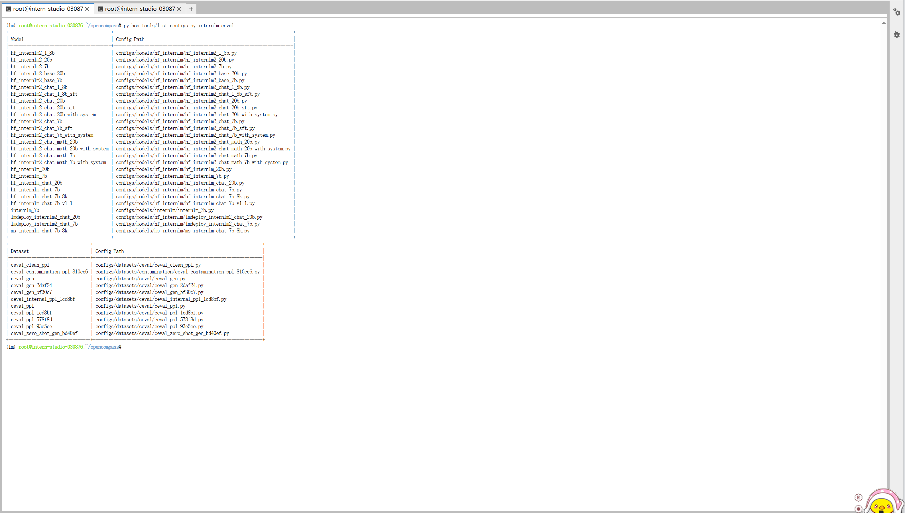

# 基础作业

## 使用 OpenCompass 评测 internlm2-chat-1_8b 模型在 C-Eval 数据集上的性能

### 概览


在 OpenCompass 中评估一个模型通常包括以下几个阶段：配置 -> 推理 -> 评估 -> 可视化。

- 配置：这是整个工作流的起点。您需要配置整个评估过程，选择要评估的模型和数据集。此外，还可以选择评估策略、计算后端等，并定义显示结果的方式。
- 推理与评估：在这个阶段，OpenCompass 将会开始对模型和数据集进行并行推理和评估。推理阶段主要是让模型从数据集产生输出，而评估阶段则是衡量这些输出与标准答案的匹配程度。这两个过程会被拆分为多个同时运行的“任务”以提高效率，但请注意，如果计算资源有限，这种策略可能会使评测变得更慢。如果需要了解该问题及解决方案，可以参考 FAQ: 效率。
- 可视化：评估完成后，OpenCompass 将结果整理成易读的表格，并将其保存为 CSV 和 TXT 文件。你也可以激活飞书状态上报功能，此后可以在飞书客户端中及时获得评测状态报告。 接下来，我们将展示 OpenCompass 的基础用法，展示书生浦语在 `C-Eval` 基准任务上的评估。它们的配置文件可以在 `configs/eval_demo.py` 中找到。

### 安装

```sh
cd /root

git clone -b 0.2.4 https://github.com/open-compass/opencompass
cd opencompass
pip install -v -e .

# 补充安装
pip install -r requirements/runtime.txt
```


### 数据准备

解压评测数据集到 data/ 处

```sh
cd /root/opencompass
cp /share/temp/datasets/OpenCompassData-core-20231110.zip /root/opencompass/
unzip OpenCompassData-core-20231110.zip
rm OpenCompassData-core-20231110.zip
```


### 查看支持的数据集和模型

列出所有跟 internlm 及 ceval 相关的配置

```sh
cd /root/opencompass
python tools/list_configs.py internlm ceval
```

运行命令

```sh
(lm) root@intern-studio-030876:~/opencompass# python tools/list_configs.py internlm ceval
+----------------------------------------+----------------------------------------------------------------------+
| Model                                  | Config Path                                                          |
|----------------------------------------+----------------------------------------------------------------------|
| hf_internlm2_1_8b                      | configs/models/hf_internlm/hf_internlm2_1_8b.py                      |
| hf_internlm2_20b                       | configs/models/hf_internlm/hf_internlm2_20b.py                       |
| hf_internlm2_7b                        | configs/models/hf_internlm/hf_internlm2_7b.py                        |
| hf_internlm2_base_20b                  | configs/models/hf_internlm/hf_internlm2_base_20b.py                  |
| hf_internlm2_base_7b                   | configs/models/hf_internlm/hf_internlm2_base_7b.py                   |
| hf_internlm2_chat_1_8b                 | configs/models/hf_internlm/hf_internlm2_chat_1_8b.py                 |
| hf_internlm2_chat_1_8b_sft             | configs/models/hf_internlm/hf_internlm2_chat_1_8b_sft.py             |
| hf_internlm2_chat_20b                  | configs/models/hf_internlm/hf_internlm2_chat_20b.py                  |
| hf_internlm2_chat_20b_sft              | configs/models/hf_internlm/hf_internlm2_chat_20b_sft.py              |
| hf_internlm2_chat_20b_with_system      | configs/models/hf_internlm/hf_internlm2_chat_20b_with_system.py      |
| hf_internlm2_chat_7b                   | configs/models/hf_internlm/hf_internlm2_chat_7b.py                   |
| hf_internlm2_chat_7b_sft               | configs/models/hf_internlm/hf_internlm2_chat_7b_sft.py               |
| hf_internlm2_chat_7b_with_system       | configs/models/hf_internlm/hf_internlm2_chat_7b_with_system.py       |
| hf_internlm2_chat_math_20b             | configs/models/hf_internlm/hf_internlm2_chat_math_20b.py             |
| hf_internlm2_chat_math_20b_with_system | configs/models/hf_internlm/hf_internlm2_chat_math_20b_with_system.py |
| hf_internlm2_chat_math_7b              | configs/models/hf_internlm/hf_internlm2_chat_math_7b.py              |
| hf_internlm2_chat_math_7b_with_system  | configs/models/hf_internlm/hf_internlm2_chat_math_7b_with_system.py  |
| hf_internlm_20b                        | configs/models/hf_internlm/hf_internlm_20b.py                        |
| hf_internlm_7b                         | configs/models/hf_internlm/hf_internlm_7b.py                         |
| hf_internlm_chat_20b                   | configs/models/hf_internlm/hf_internlm_chat_20b.py                   |
| hf_internlm_chat_7b                    | configs/models/hf_internlm/hf_internlm_chat_7b.py                    |
| hf_internlm_chat_7b_8k                 | configs/models/hf_internlm/hf_internlm_chat_7b_8k.py                 |
| hf_internlm_chat_7b_v1_1               | configs/models/hf_internlm/hf_internlm_chat_7b_v1_1.py               |
| internlm_7b                            | configs/models/internlm/internlm_7b.py                               |
| lmdeploy_internlm2_chat_20b            | configs/models/hf_internlm/lmdeploy_internlm2_chat_20b.py            |
| lmdeploy_internlm2_chat_7b             | configs/models/hf_internlm/lmdeploy_internlm2_chat_7b.py             |
| ms_internlm_chat_7b_8k                 | configs/models/ms_internlm/ms_internlm_chat_7b_8k.py                 |
+----------------------------------------+----------------------------------------------------------------------+
+--------------------------------+------------------------------------------------------------------+
| Dataset                        | Config Path                                                      |
|--------------------------------+------------------------------------------------------------------|
| ceval_clean_ppl                | configs/datasets/ceval/ceval_clean_ppl.py                        |
| ceval_contamination_ppl_810ec6 | configs/datasets/contamination/ceval_contamination_ppl_810ec6.py |
| ceval_gen                      | configs/datasets/ceval/ceval_gen.py                              |
| ceval_gen_2daf24               | configs/datasets/ceval/ceval_gen_2daf24.py                       |
| ceval_gen_5f30c7               | configs/datasets/ceval/ceval_gen_5f30c7.py                       |
| ceval_internal_ppl_1cd8bf      | configs/datasets/ceval/ceval_internal_ppl_1cd8bf.py              |
| ceval_ppl                      | configs/datasets/ceval/ceval_ppl.py                              |
| ceval_ppl_1cd8bf               | configs/datasets/ceval/ceval_ppl_1cd8bf.py                       |
| ceval_ppl_578f8d               | configs/datasets/ceval/ceval_ppl_578f8d.py                       |
| ceval_ppl_93e5ce               | configs/datasets/ceval/ceval_ppl_93e5ce.py                       |
| ceval_zero_shot_gen_bd40ef     | configs/datasets/ceval/ceval_zero_shot_gen_bd40ef.py             |
+--------------------------------+------------------------------------------------------------------+
```




### 启动评测 

确保按照上述步骤正确安装 OpenCompass 并准备好数据集后，可以通过以下命令评测 InternLM2-Chat-1.8B 模型在 C-Eval 数据集上的性能。由于 OpenCompass 默认并行启动评估过程，我们可以在第一次运行时以 --debug 模式启动评估，并检查是否存在问题。在 --debug 模式下，任务将按顺序执行，并实时打印输出。

```sh
cd /root/opencompass

python run.py \
--datasets ceval_gen \
--hf-path /root/models/internlm2-chat-1_8b \  # HuggingFace 模型路径
--tokenizer-path /root/models/internlm2-chat-1_8b \  # HuggingFace tokenizer 路径（如果与模型路径相同，可以省略）
--tokenizer-kwargs padding_side='left' truncation='left' trust_remote_code=True \  # 构建 tokenizer 的参数
--model-kwargs device_map='auto' trust_remote_code=True \  # 构建模型的参数
--max-seq-len 2048 \  # 模型可以接受的最大序列长度
--max-out-len 16 \  # 生成的最大 token 数
--batch-size 4 \  # 批量大小
--num-gpus 1 \  # 运行模型所需的 GPU 数量
--debug

python run.py \
--datasets ceval_gen \
--hf-path /root/models/internlm2-chat-1_8b \
--tokenizer-path /root/models/internlm2-chat-1_8b \
--tokenizer-kwargs padding_side='left' truncation='left' trust_remote_code=True \
--model-kwargs device_map='auto' trust_remote_code=True \
--max-seq-len 2048 \
--max-out-len 16 \
--batch-size 4 \
--num-gpus 1 \
--debug
```


# 进阶作业


## 将自定义数据集提交至OpenCompass官网